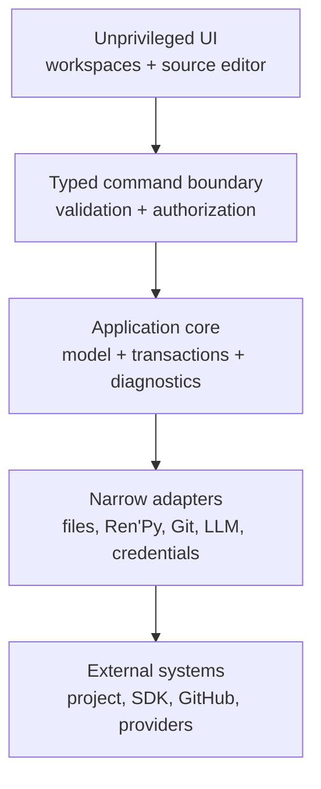
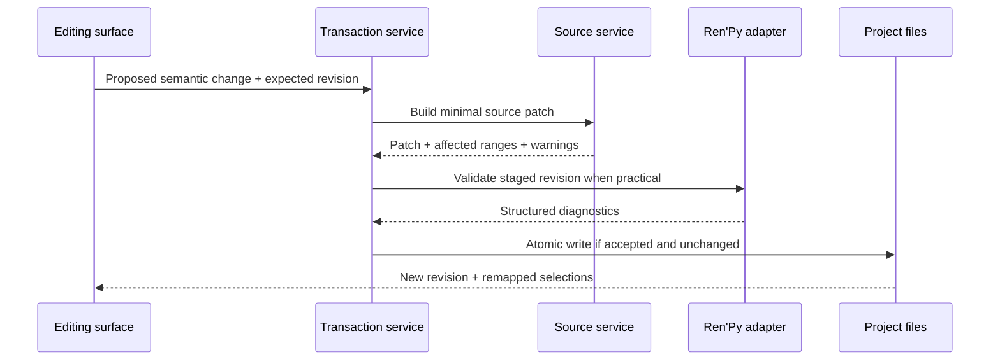

# Architecture checkpoint

## Status

This is the accepted Phase 0 target architecture. ADR 0001 selects exact source bytes
plus a conservative partial CST, ADR 0002 selects the versioned SDK boundary, and
[ADR 0003](adr/0003-tauri-desktop-runtime.md) selects Tauri 2. The boundaries remain
framework-light even though the production shell is now explicit.

## System boundaries



The UI never receives general filesystem or process access. Core business logic is
UI-framework-independent and invokes external effects through interfaces. Adapters
return typed results, structured diagnostics, and redacted logs.

## Desktop runtime

Tauri 2 hosts the local shared UI. Its Rust core owns validation and privileged
adapters; the main webview receives only named, schema-validated application commands
through an explicit capability. General shell, filesystem, and HTTP plugin authority
is not granted to the webview. Windows WebView2 and macOS WKWebView are separate test
targets, and engine-specific behavior is recorded rather than normalized away.

Electron remains the ADR-defined fallback, not a second production implementation.
The disposable candidates under `spikes/desktop-shells/` are evidence only and must
not be imported as the Phase 1 production architecture.

## Proposed components

| Component | Responsibility | Must not do |
| --- | --- | --- |
| Desktop shell | Windows, lifecycle, update/package plumbing, IPC gate | Expose raw Node/Rust/system APIs to UI |
| Workspace UI | Scene, graph, source, screens, timeline, inspectors | Write files or launch processes directly |
| Source service | Token/CST model, stable IDs, source ranges, minimal patches | Regex-based whole-file rewriting |
| Domain model | Project, scene/beat graph, state, lore, assets | Become a second source of runnable truth |
| Transaction service | Preview, validate, atomic commit, undo/redo, recovery | Maintain separate visual/source/LLM edit paths |
| File coordinator | Watch, hash/revision, conflict detection, safe paths | Follow unchecked symlinks or overwrite conflicts |
| Ren'Py adapter | Versioned CLI discovery, compile/lint/run/test/build | Treat CLI output or private internals as stable |
| Preview service | Fast editor approximation plus official runtime launch | Claim full fidelity without Ren'Py runtime |
| Git adapter | Status, diff, checkpoints, history, safe restore, remote flows | Force-push or destructively reset by default |
| LLM service | Providers, context selection, proposals, schema validation | Send content without explicit user action |
| Credential service | OS keychain/credential store references | Store plaintext secrets in project metadata |

## Source and edit data flow



LLM operations enter at the first step as proposals and cannot bypass review.
External file-watch events enter the source service with a content hash; supported
changes update the visual model, while unsupported regions remain visible custom
code and mark the owning scene or screen partially visual.

## Process and trust boundaries

1. **Renderer/webview:** untrusted presentation tier; no ambient host privileges.
2. **Desktop core:** privileged but capability-limited; validates all IPC payloads.
3. **Project filesystem:** user-controlled and potentially hostile paths/content.
4. **Ren'Py child process:** executes project Python only after explicit trust/run.
5. **Network:** disabled except explicit SDK, GitHub, update, or LLM operations.
6. **Credential store:** secrets are referenced, never copied into project files.

See [SECURITY.md](SECURITY.md) for mitigations and consent boundaries.

## Project layout generated later

```text
game/
  script.rpy
  definitions/{characters,variables,transforms}.rpy
  chapters/chapter_01/scene_001.rpy
  screens/
  systems/
  assets/{backgrounds,characters,ui,audio,video,fonts}/
.renpy-editor/
  project.json
  graph.json
  lore.json
  recovery/
```

Exact filenames and schemas are gated by parser/order and migration spikes. Generated
projects remain conventional and runnable when `.renpy-editor/` is absent.

## External-change reconciliation

- Watch events are debounced and compared using content hashes, not timestamps only.
- A transaction records the base revision. If disk changed, no blind write occurs.
- Reparse and map supported edits; surface unsupported regions without relocating
  them. If both revisions touch the same source range, present a three-way conflict.
- Autosave writes recoverable journal/snapshot data first, then uses same-directory
  temporary files plus atomic replacement where the platform/filesystem supports it.
- Undo/redo records semantic intent and exact patches; it stops at unresolved
  external conflicts rather than applying stale inverses.

## Preview boundary

The embedded preview may render supported staging quickly, but the selected official
SDK is the fidelity authority. Unsupported displayables, Python-driven state, screens,
ATL, and platform behavior require launching Ren'Py. Development warp or generated
harnesses must be version-tested and excluded from release distributions.

## Resolved Phase 0 boundaries and implementation risks

Phase 0 resolved the desktop runtime, source model, SDK adapter/install boundary,
preview fidelity classes, and target atomic/watch behavior. Phase 1 still has to turn
those decisions into production services and recovery UX. Manual assistive-technology,
physical signing/quarantine/SmartScreen, system-WebView variance, and full automatic
graph-layout performance remain explicit later validation risks; they do not reopen
the completed Phase 0 decision without contradictory evidence.
