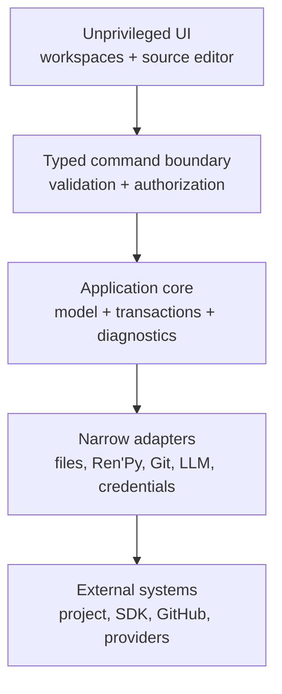

# Architecture checkpoint

## Status

This is the accepted Phase 0 target architecture plus the Phase 1A–1F production
architecture. ADR 0001 selects exact source bytes plus a conservative partial CST,
ADR 0002 selects the versioned SDK boundary, ADR 0003 selects Tauri 2, ADRs 0004–0005
define transaction and project-creation safety, and
[ADR 0006](adr/0006-scene-authoring-source-and-media-boundary.md) defines the bounded
Scene/source/media boundary. The production application lives in `app/`; Phase 1F is
implemented on its review branch and later milestones remain separately gated.

## Production scaffold boundary

The production workspace is a small Cargo workspace plus a vanilla TypeScript/Vite UI.
`loomlight-core` owns the framework-independent versioned protocol and can be tested
without a desktop/WebView dependency. `loomlight-desktop` contains the Tauri host and
the single custom command `core_request`. That command accepts an untyped JSON value so
the core can reject malformed envelopes itself and always return the same redacted
result shape.

Protocol version 1 requires exactly `protocolVersion`, `requestId`, `operation`, and
`payload`. The allowlist now includes lifecycle, supporting authoring, Scene semantic
operations, Source inventory/draft/acceptance/reconciliation, persistence/recovery,
and asset-ID media presentation. Every operation is schema checked and session bound
in core. The capability is local, scoped to WebView
label `main`, and names only `allow-loomlight-core`; no general Tauri filesystem,
shell/process, HTTP, opener, or credential plugin is present. Git, credentials, and
network providers remain unavailable to renderer operations.

## System boundaries



The UI never receives general filesystem or process access. Core business logic is
UI-framework-independent and invokes external effects through interfaces. Adapters
return typed results, structured diagnostics, and redacted logs.

## Desktop runtime

Tauri 2 hosts the local shared UI. Its Rust core owns validation and privileged
adapters; the main webview receives only named, schema-validated application commands
through an explicit capability. General shell, filesystem, and HTTP plugin authority
is not granted to the webview. Windows WebView2 and macOS WKWebView are separate test
targets, and engine-specific behavior is recorded rather than normalized away.

Phase 1C keeps native folder pickers in the trusted desktop host and returns opaque
parent/SDK/recent IDs. The core owns application-local Recent Projects, approved
parent handles, project metadata, SDK download/extraction, allowlisted subprocesses,
and current open-project lifecycle state.

Phase 1D binds one ephemeral transaction authority to that current project. Stable
project UUID and process authority remain distinct; close or project switch invalidates
the latter. The host retains native-selected media handles and returns only opaque
import IDs plus safe basename/extension/size metadata. Media streams through
transaction recovery and never enters renderer state or a generic filesystem API.

Phase 1E extends the same authority with ordered multi-Chapter/Scene metadata, exact-
range Beat operations, session-local committed history, and explicit recovery
resolution. Scene writes never originate in the renderer: `scene.apply` submits a
typed semantic command whose core implementation verifies current metadata and source
revisions, constructs the smallest safe mutation set, and commits through the shared
transaction service. `media.present` is read-only and accepts an Asset UUID plus a
presentation purpose, never a path or URL.

Loomlight is a single-instance desktop application. The maintained Tauri
single-instance plugin is registered before desktop `setup`, so a losing launch is
rejected before it can construct `LifecycleService`. The primary process is therefore
the sole owner and coordinator of mutable application lifecycle state, including
Recent Projects and the current project. A second launch only asks the primary main
window to restore, show, and focus; it does not add argument forwarding or project-open
semantics. Independent concurrent Loomlight processes and multi-process editing are not
supported.

Recent Projects uses a retained application-state directory anchor. Updates are fully
serialized into a private create-new sibling, platform-flushed (`F_FULLFSYNC` for the
file on macOS), atomically replace the live regular file, flush the directory where
supported, and verify the committed bytes. Pre-commit failure leaves the preceding
store intact; a crash after replacement exposes the complete new store. Stale files
from prior processes are ignored rather than broadly enumerated or deleted.

Managed SDK installation checksum-validates and safely extracts the official pinned
archive into a private unit, recursively flushes the extracted tree, validates the
launcher/template, writes checksum-derived provenance inside that unit, flushes it,
then performs one retained-parent no-replace promotion. Interrupted owned candidates,
stages, and partial downloads are moved into uniquely named quarantine entries; they
cannot wedge retry and are not recursively deleted during recovery. The prior external
provenance layout migrates only when it exactly matches the inspected SDK. Managed
discovery establishes directory identity and launcher/template fingerprints without
executing the SDK, requires embedded or legacy checksum-derived provenance to match,
and only then performs the exact-version probe; post-probe identity is checked again.

Electron remains the ADR-defined fallback, not a second production implementation.
The disposable candidates under `spikes/desktop-shells/` are evidence only and must
not be imported as the Phase 1 production architecture.

## Proposed components

| Component | Responsibility | Must not do |
| --- | --- | --- |
| Desktop shell | Windows, lifecycle, update/package plumbing, IPC gate | Expose raw Node/Rust/system APIs to UI |
| Workspace UI | Scene, graph, source, screens, timeline, inspectors | Write files or launch processes directly |
| Source service | Token/CST model, stable IDs, source ranges, minimal patches | Regex-based whole-file rewriting |
| Domain model | Project, chapter/scene/beat graph, state, characters, assets | Become a second source of runnable truth |
| Transaction service | Preview, validate, commit, undo/redo, recovery | Maintain separate visual/source/LLM edit paths |
| File coordinator | Watch, hash/revision, conflict detection, safe paths | Follow unchecked symlinks or overwrite conflicts |
| Ren'Py adapter | Versioned CLI discovery, compile/lint/run/test/build | Treat CLI output or private internals as stable |
| Preview service | Fast editor approximation plus official runtime launch | Claim full fidelity without Ren'Py runtime |
| Git adapter | Status, diff, checkpoints, history, safe restore, remote flows | Force-push or destructively reset by default |
| LLM service | Providers, context selection, proposals, schema validation | Send content without explicit user action |
| Credential service | OS keychain/credential store references | Store plaintext secrets in project metadata |

## Source and edit data flow


LLM operations enter at the first step as proposals and cannot bypass review.
External file-watch events enter the source service with a content hash; supported
changes update the visual model, while unsupported regions remain visible custom code
and mark the owning scene or screen partially visual.

## Transactional persistence and save semantics

Every accepted visual or source edit uses the same transaction path. Loomlight does
not keep a long-lived visual document that is later exported over authoritative
source. Short-lived typing/edit buffers may group a natural edit burst; after idle,
blur, or an explicit action they become one semantic transaction and are persisted
through the source/file boundary.

The shell always exposes a meaningful persistence state such as `Saved`, `Saving`,
`Unsubmitted editor input`, `Pending validation`, `Conflict`, or `Recovery required`.
One application-lifetime shell adapter owns `Ctrl/Cmd+S`. Outside Source editing it is
an explicit Flush/durability action. In a Source editing context, the registered
document controller captures the session, controller, open generation and latest input,
settles ordered draft retention under the existing per-session mutation lease, and
accepts that exact draft once. A clean settled Source falls through to normal Flush
without an ownership gap; refusal never falls through. Successful Source acceptance is
already durable through the shared transaction and does not append another Flush.

Undo/redo records semantic intent and exact patches across visual and source edits.
External filesystem revisions are safety boundaries: undo/redo must not silently
replace a newer external revision. Conflicts should block writes to the affected
file/scene while allowing unrelated scenes to remain editable when safe.

Phase 1B implements Gate E as a multi-mutation journalled recovery protocol. Recovery
artifacts live only in an anchored transaction directory. macOS uses descriptor-
relative rename exchange between that directory and an anchored target parent;
Windows pins the validated directory chain against rename/delete while performing
replacement with a same-volume recovery backup. Both retain the displaced target and
verify it after the namespace operation, so a final-window writer becomes a preserved
conflict instead of silent loss. The sequence is not described as portable compare-
and-swap or multi-file atomicity. Exact state, durability, and filesystem limits are in
[TRANSACTIONS.md](TRANSACTIONS.md).

## Process and trust boundaries

1. **Renderer/webview:** untrusted presentation tier; no ambient host privileges.
2. **Desktop core:** privileged but capability-limited; validates all IPC payloads.
3. **Project filesystem:** user-controlled and potentially hostile paths/content.
4. **Ren'Py child process:** executes project Python only after explicit trust/run.
5. **Network:** disabled except explicit SDK, GitHub, update, or LLM operations.
6. **Credential store:** secrets are referenced, never copied into project files.

See [SECURITY.md](SECURITY.md) for mitigations and consent boundaries.

## Loomlight-created project convention

Phase 1 creates new Loomlight projects only; general import of arbitrary existing
Ren'Py projects remains deferred. The generated project is conventional Ren'Py and
preserves the supported SDK template's normal GUI/runtime files while adding Loomlight's
modular story structure:

```text
game/
  script.rpy
  options.rpy
  gui.rpy
  screens.rpy
  definitions/
    characters.rpy
    variables.rpy
    transforms.rpy
  chapters/
    chapter_01/
      scene_001.rpy
  images/
    backgrounds/
    characters/
  audio/
  gui/
.renpy-editor/
  project.json
  source-map.json
  authoring.json
  recovery/
```

`images/`, `audio/`, `gui/`, `gui.rpy`, `options.rpy`, and `screens.rpy` follow normal
Ren'Py project conventions. Loomlight's **Assets** surface is a product abstraction,
not a requirement for a physical `game/assets/` directory. Image/appearance imports go
under `game/images/`; audio goes under `game/audio/`; standard GUI resources remain
under `game/gui/`. Exact safe naming and collision rules are defined and tested in the
implementing milestone so automatic Ren'Py discovery does not create ambiguous image
or audio names.

`script.rpy` remains deliberately small and routes the normal game entry point into
the first scene. Each Loomlight-created Scene normally owns one `.rpy` file and one
primary globally unique technical label such as `chapter_01_scene_001`. Chapter names
and Scene display names are editor-facing organisation; changing a display name does
not implicitly rename the technical label or source file. Story flow uses explicit
Ren'Py labels/jumps/calls and never depends on filesystem parse order.

Ren'Py-generated `.rpyc` files are derivative runtime/cache artifacts, never
Loomlight's source authority. Ren'Py will execute an orphan `.rpyc` when its `.rpy` is
removed, moved, or renamed, so every supported Scene/source-file lifecycle transaction
that removes the old `.rpy` path must also remove the obsolete corresponding `.rpyc`
within the approved project root. The next Ren'Py validation/run may regenerate the
compiled file at the new path. This cleanup is part of the same reviewed file
transaction and must be covered by ghost-script/duplicate-label regression tests.

The generated project must run when `.renpy-editor/` is absent. Phase 1 opening/recent
project flows require valid Loomlight metadata; deleting that metadata and asking the
editor to reconstruct the project is treated as future existing-project import, not a
Phase 1 recovery path.

`authoring.json` schema version 1 stores stable Character, Appearance, Asset, and
Variable UUIDs and relationships. Project and source-map schema version 2 adds ordered
multi-Chapter/Scene ownership, entry/selection state, and exact Beat mappings while
transactionally migrating the valid version 1 scaffold without changing its UUIDs or
unknown fields. All metadata is editor-only and never competes with runnable source.
`characters.rpy`, `variables.rpy`, and Scene `.rpy` files remain authoritative and are
edited by a
narrow lexical/context-aware exact-statement mapper. A supported definition must be a
complete unique top-level executable statement, not matching text in a comment,
multiline string, continuation, or indented opaque block. Canonical definitions are
inserted or patched only after every relevant mapping and the expected file revision
are verified; unrelated/unsupported bytes, Unicode, formatting, and line endings remain
untouched. This recognizer is intentionally not a general Ren'Py parser. Phase 1F
reuses it for bounded Source mapping and leaves all unproved syntax visibly opaque.

The Scene recognizer follows the same rule: supported canonical Beats retain stable
IDs, exact byte ranges, hashes, and lexical context; unsupported regions become
protected Custom Code. Insert, replace, remove, and reorder refuse ambiguous ownership
or opaque crossings. Scene create/move/delete commits source, metadata, references,
and only a proven corresponding obsolete `.rpyc` as one recoverable semantic change.

Project creation itself is staged: validate destination safety, generate the scaffold
and metadata in a private staging location, optionally initialise local Git, validate
through the pinned SDK, then finalise the project. A failed creation must not leave a
half-created directory presented as a successful Loomlight project.

ADR 0005 implements that flow using Ren'Py 8.5.3's documented launcher
`generate_gui <stage> --width ... --height ... --start` command. Loomlight applies its
deterministic modular overlay, optionally calls direct `git init`, compiles/lints the
freshly controlled stage, then revalidates the retained parent identity and performs a
same-parent no-replace rename (`renameatx_np(RENAME_EXCL)` on macOS and `MoveFileExW`
without replacement on Windows; Linux uses `renameat2(RENAME_NOREPLACE)` for local
regression). An existing destination, including an empty directory or link, is
refused. This service is separate from Phase 1B's existing-file replacement boundary.

## Extensible authoring references

Phase 1 intentionally exposes small useful subsets without making them throwaway
special cases:

- character visuals use appearance references with extensible attributes; Phase 1
  exposes expression while outfit and pose are implicit defaults;
- placement uses transform/placement references; the initial UI exposes Left, Centre,
  and Right rather than storing those as an architectural coordinate system;
- transitions are references; the initial selector may expose None, Dissolve, and Fade;
- audio is represented as typed authoring events/references; Phase 1 exposes basic
  play/stop music and play SFX without preventing later channels, fades, voice, or
  Timeline integration;
- Scene beats and Branches share one semantic edge/domain model; graph data is not a
  separately generated truth.

## External-change reconciliation

- Watch events are debounced and compared using content hashes, not timestamps only.
- A transaction records the base revision. If disk changed, no blind write occurs.
- Reparse and map supported edits; surface unsupported regions without relocating
  them. A dirty buffer retains its accepted base, draft, and external bytes. Only two
  exact, non-overlapping base-relative patches expose a reviewed Apply Both result;
  overlap, deletion, ambiguity, or unsafe identity remains an explicit conflict.
- Recovery information is written before destructive commitment steps and retained
  when a known race/failure prevents safe completion.
- Source typing is session-local and never autosaves. Explicit Source Save/Save All
  and accepted visual edits use the same transaction/recovery mechanism.
- Source acceptance temporarily makes the captured editor and navigation read-only,
  drains prior retention, and fails closed while preserving local text. Navigation and
  leave settle local input without accepting it; controller/document generations and
  token-matched leases suppress stale redraw, status and cleanup.
- Undo/redo stops at unresolved external conflicts rather than applying stale inverses.

## Preview boundary

The embedded Editor Preview reconstructs supported scene-local state through the
selected beat: background, visible character appearances, placement, basic music
state, simple variables, and the selected dialogue/menu where deterministically known.
It marks runtime-dependent or unsupported state as partial/unknown rather than
inventing fidelity. Navigating beats must not repeatedly audition audio; audio has
explicit audition controls.

Preview media is a bounded presentation snapshot, not a renderer file capability.
Core resolves a current-session Asset UUID, retains and revalidates the safe relative
path and regular-file identity, verifies recorded size/hash, accepts only passive
PNG/JPEG or OGG/WAV/FLAC/MP3 presentation bytes, caps delivery at 16 MiB, and caps
images at 8192 pixels per dimension. Returned data is content keyed. Renderer caches
are memory-only, cancelled by view generation, invalidated by content key, and fully
disposed on project/session switch. Audio starts only from an explicit user action.

The selected official SDK remains the fidelity authority. Phase 1 provides normal
`Run Game` from the game entry point and explicit validation; correct arbitrary
`Run From Here` is deferred until state simulation can establish the required prior
state. Unsupported displayables, Python-driven state, screens, ATL, and platform
behavior require the official runtime.

## Resolved Phase 0 boundaries and implementation risks

Phase 0 resolved the desktop runtime, source model, SDK adapter/install boundary,
preview fidelity classes, and target atomic/watch observations. Phase 1A–1F have
turned the scaffold, lifecycle, supporting authoring, Scene source operations,
recovery UX, bounded preview/media, and direct Source synchronisation decisions into
production services. Manual assistive-
technology, physical signing/quarantine/SmartScreen, system-WebView variance, and full
automatic graph-layout performance remain explicit later validation risks; they do
not reopen the completed Phase 0 decision without contradictory evidence.

## Corrective project-session handoff

Each successful activation issues an opaque session ID distinct from the stable
project UUID. Authoring, import selection/use, persistence status, flush, and close
require the exact current session while lifecycle dispatch is serialized. A candidate
retains the directory authority acquired during inspection and is recovery-checked
before replacing the current session; failed activation leaves the prior project
active. Renderer navigation generations discard late results from replaced sessions.
Every asynchronous UI completion also carries its originating view, operation, and
session generation. Late success, failure, cancellation, close/open, status, and
mutation callbacks therefore cannot restore an obsolete project or overwrite newer
persistence feedback.
