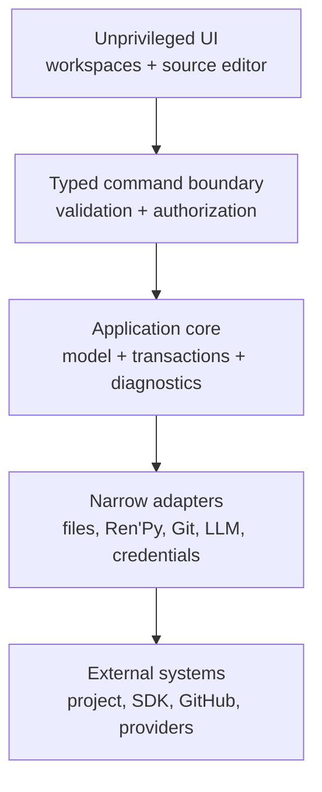

# Architecture checkpoint

## Status

This is the accepted Phase 0 target architecture plus the approved Phase 1 planning
constraints. ADR 0001 selects exact source bytes plus a conservative partial CST,
ADR 0002 selects the versioned SDK boundary, and
[ADR 0003](adr/0003-tauri-desktop-runtime.md) selects Tauri 2. The boundaries remain
framework-light even though the production shell is now explicit. Phase 1
implementation still requires explicit approval and begins with the bounded production
scaffold rather than promotion of a spike.

## System boundaries



The UI never receives general filesystem or process access. Core business logic is
UI-framework-independent and invokes external effects through interfaces. Adapters
return typed results, structured diagnostics, and redacted logs.

## Desktop runtime

Tauri 2 hosts the local shared UI. Its Rust core owns validation and privileged
adapters; the main webview receives only named, schema-validated application commands
through an explicit capability. General shell, filesystem, and HTTP plugin authority
is not granted to the webview. Windows WebView2 and macOS WKWebView are separate test
targets, and engine-specific behavior is recorded rather than normalized away.

Electron remains the ADR-defined fallback, not a second production implementation.
The disposable candidates under `spikes/desktop-shells/` are evidence only and must
not be imported as the Phase 1 production architecture.

## Proposed components

| Component | Responsibility | Must not do |
| --- | --- | --- |
| Desktop shell | Windows, lifecycle, update/package plumbing, IPC gate | Expose raw Node/Rust/system APIs to UI |
| Workspace UI | Scene, graph, source, screens, timeline, inspectors | Write files or launch processes directly |
| Source service | Token/CST model, stable IDs, source ranges, minimal patches | Regex-based whole-file rewriting |
| Domain model | Project, chapter/scene/beat graph, state, characters, assets | Become a second source of runnable truth |
| Transaction service | Preview, validate, commit, undo/redo, recovery | Maintain separate visual/source/LLM edit paths |
| File coordinator | Watch, hash/revision, conflict detection, safe paths | Follow unchecked symlinks or overwrite conflicts |
| Ren'Py adapter | Versioned CLI discovery, compile/lint/run/test/build | Treat CLI output or private internals as stable |
| Preview service | Fast editor approximation plus official runtime launch | Claim full fidelity without Ren'Py runtime |
| Git adapter | Status, diff, checkpoints, history, safe restore, remote flows | Force-push or destructively reset by default |
| LLM service | Providers, context selection, proposals, schema validation | Send content without explicit user action |
| Credential service | OS keychain/credential store references | Store plaintext secrets in project metadata |

## Source and edit data flow


LLM operations enter at the first step as proposals and cannot bypass review.
External file-watch events enter the source service with a content hash; supported
changes update the visual model, while unsupported regions remain visible custom code
and mark the owning scene or screen partially visual.

## Transactional persistence and save semantics

Every accepted visual or source edit uses the same transaction path. Loomlight does
not keep a long-lived visual document that is later exported over authoritative
source. Short-lived typing/edit buffers may group a natural edit burst; after idle,
blur, or an explicit action they become one semantic transaction and are persisted
through the source/file boundary.

The shell always exposes a meaningful persistence state such as `Saved`, `Saving`,
`Pending validation`, `Conflict`, or `Recovery required`. `Ctrl/Cmd+S` remains an
explicit flush/durability action: it completes pending accepted work and confirms that
the project is durably persisted; it is not the only moment when visual state is
translated into `.rpy`.

Undo/redo records semantic intent and exact patches across visual and source edits.
External filesystem revisions are safety boundaries: undo/redo must not silently
replace a newer external revision. Conflicts should block writes to the affected
file/scene while allowing unrelated scenes to remain editable when safe.

Phase 0 did not close parser/file Gate E. Before production authoring writes are
accepted, Phase 1 must prove the platform transaction/recovery design against external
writer races, path/file identity changes, crash points, and durability limits. The
production design may use stronger platform primitives, backup/exchange semantics, or
another reviewed mechanism, but it must preserve competing external data rather than
claim a portable compare-and-swap guarantee that the platform cannot provide.

## Process and trust boundaries

1. **Renderer/webview:** untrusted presentation tier; no ambient host privileges.
2. **Desktop core:** privileged but capability-limited; validates all IPC payloads.
3. **Project filesystem:** user-controlled and potentially hostile paths/content.
4. **Ren'Py child process:** executes project Python only after explicit trust/run.
5. **Network:** disabled except explicit SDK, GitHub, update, or LLM operations.
6. **Credential store:** secrets are referenced, never copied into project files.

See [SECURITY.md](SECURITY.md) for mitigations and consent boundaries.

## Loomlight-created project convention

Phase 1 creates new Loomlight projects only; general import of arbitrary existing
Ren'Py projects remains deferred. The generated project is conventional Ren'Py and
uses a maintainable authoring convention rather than a runtime dependency on editor
metadata:

```text
game/
  script.rpy
  definitions/
    characters.rpy
    variables.rpy
    transforms.rpy
  chapters/
    chapter_01/
      scene_001.rpy
  assets/
    backgrounds/
    characters/
    audio/
    ui/
.renpy-editor/
  project.json
  source-map.json
  recovery/
```

`script.rpy` remains deliberately small and routes the normal game entry point into
the first scene. Each Loomlight-created Scene normally owns one `.rpy` file and one
primary globally unique technical label such as `chapter_01_scene_001`. Chapter names
and Scene display names are editor-facing organisation; changing a display name does
not implicitly rename the technical label or source file. Story flow uses explicit
Ren'Py labels/jumps/calls and never depends on filesystem parse order.

The generated project must run when `.renpy-editor/` is absent. Phase 1 opening/recent
project flows require valid Loomlight metadata; deleting that metadata and asking the
editor to reconstruct the project is treated as future existing-project import, not a
Phase 1 recovery path.

Project creation itself is staged: validate destination safety, generate the scaffold
and metadata in a private staging location, optionally initialise local Git, validate
through the pinned SDK, then finalise the project. A failed creation must not leave a
half-created directory presented as a successful Loomlight project.

## Extensible authoring references

Phase 1 intentionally exposes small useful subsets without making them throwaway
special cases:

- character visuals use appearance references with extensible attributes; Phase 1
  exposes expression while outfit and pose are implicit defaults;
- placement uses transform/placement references; the initial UI exposes Left, Centre,
  and Right rather than storing those as an architectural coordinate system;
- transitions are references; the initial selector may expose None, Dissolve, and Fade;
- audio is represented as typed authoring events/references; Phase 1 exposes basic
  play/stop music and play SFX without preventing later channels, fades, voice, or
  Timeline integration;
- Scene beats and Branches share one semantic edge/domain model; graph data is not a
  separately generated truth.

## External-change reconciliation

- Watch events are debounced and compared using content hashes, not timestamps only.
- A transaction records the base revision. If disk changed, no blind write occurs.
- Reparse and map supported edits; surface unsupported regions without relocating
  them. If both revisions touch the same source range, present an explicit conflict.
- Recovery information is written before destructive commitment steps and retained
  when a known race/failure prevents safe completion.
- Autosave and explicit save/flush use the same transaction/recovery mechanism.
- Undo/redo stops at unresolved external conflicts rather than applying stale inverses.

## Preview boundary

The embedded Editor Preview reconstructs supported scene-local state through the
selected beat: background, visible character appearances, placement, basic music
state, simple variables, and the selected dialogue/menu where deterministically known.
It marks runtime-dependent or unsupported state as partial/unknown rather than
inventing fidelity. Navigating beats must not repeatedly audition audio; audio has
explicit audition controls.

The selected official SDK remains the fidelity authority. Phase 1 provides normal
`Run Game` from the game entry point and explicit validation; correct arbitrary
`Run From Here` is deferred until state simulation can establish the required prior
state. Unsupported displayables, Python-driven state, screens, ATL, and platform
behavior require the official runtime.

## Resolved Phase 0 boundaries and implementation risks

Phase 0 resolved the desktop runtime, source model, SDK adapter/install boundary,
preview fidelity classes, and target atomic/watch observations. Phase 1 still has to
turn those decisions into production services and recovery UX. Manual assistive-
technology, physical signing/quarantine/SmartScreen, system-WebView variance, and full
automatic graph-layout performance remain explicit later validation risks; they do
not reopen the completed Phase 0 decision without contradictory evidence.
