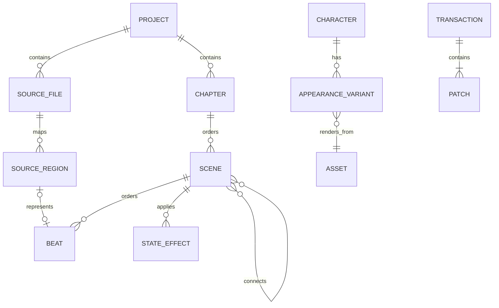

# Data model

## Authority and identity

Runnable truth lives in `.rpy` files. Editor metadata references source; it never
silently replaces it. Every supported visual object receives a stable editor UUID
mapped to a file revision/hash and source range. Human-authored Ren'Py identifiers
remain unchanged unless the user explicitly renames them through a reference-aware
transaction.

For Loomlight-created projects the authoring hierarchy is:

`Project → Chapter → Scene → Beat`

A Chapter is organisational. A Scene normally maps to one `.rpy` file and one primary
globally unique Ren'Py label; Branch edges connect scenes explicitly. Display names,
technical labels, filenames, and stable UUIDs are distinct identities so a cosmetic
rename does not create unnecessary source churn.



## Source layer

| Entity | Essential fields |
| --- | --- |
| Source file | project-relative path, byte content/revision hash, encoding, parse status |
| Source region | stable ID, byte/line range, tokens/trivia, supported kind, parent region |
| Custom-code region | exact text/range, surrounding anchors, reason unsupported, warnings |
| Diagnostic | SDK/version, file/range, severity, code/category, raw excerpt, remediation |

The parser must retain comments, whitespace/trivia, statement order, identifiers,
embedded Python, screen language, ATL, translations, and unknown syntax. Source
ranges are invalidated and remapped after each accepted revision. Unsupported or
ambiguous source remains in place and must not be coerced into a visual beat model.

Compiled `.rpyc` files are generated derivatives rather than authoritative source. A
supported transaction that removes, moves, or renames an `.rpy` path must remove the
obsolete corresponding `.rpyc` at the old path so Ren'Py cannot continue executing an
orphaned compiled script.

## Project and narrative layer

| Entity | Essential fields |
| --- | --- |
| Project | ID, title, folder/path identity, resolution, pinned SDK, schema version, capabilities |
| Chapter | ID, display name, ordering, project-relative directory reference |
| Scene | ID, display name, technical label, source file/regions, ordered beats, partial-visual flag |
| Beat | ID, type, source mapping, payload, conditions/effects where supported |
| Edge | source/target Scene, kind, choice text, call/jump/return semantics |
| Asset | ID, project-relative path, media type, hash, usages, import provenance |
| Character | ID, technical variable, display name, dialogue colour, default appearance, definition range |
| Appearance variant | ID, character ID, attribute map, render mode, asset/render reference |
| Variable | ID/name, supported type/default, definition range, reads/writes, persistence/category |

Phase 1E implements the bounded visual Beat set: background/scene, show/hide Character,
change appearance, placement reference, dialogue, narration, arbitrary-list
unconditional Choice, Jump, Return/End, typed simple variable assignment, play/stop
music, play SFX, transition reference, and protected Custom Code. Supporting references
use stable Character, Appearance, Asset, Variable, and Scene UUIDs rather than
filenames. Later phases extend the same Beat/semantic model rather than replacing it.

Choice, Jump, and Return/End are mutually exclusive terminal Beat forms. A newly
created Scene starts with Return/End; adding a Choice or Jump at the natural end
replaces that terminal range rather than leaving unreachable statements after it.
Terminal Beats cannot be removed, converted to a non-terminal Beat, or reordered away
from the end through the supported Scene surface.

Every recognized Beat mapping records a stable UUID, exact source revision, verified
byte range, exact range hash, and lexical context. The narrow mapper recognizes only
the supported canonical form. Unsupported/custom bytes stay in sequence as protected
regions; any operation that cannot prove source ownership or a safe boundary refuses.

## Characters and appearance

Character visuals are modeled as extensible appearance attributes, not as a filename
field on the Character. A typical future selection may be:

```text
outfit = university_uniform
pose = standing
expression = annoyed
```

Phase 1 exposes only `expression` in the normal UI; `outfit` and `pose` are implicit
`default` attributes. The schema must preserve an attribute map so later outfit, pose,
hairstyle, accessory, damage/state, or other dimensions can extend the model without a
migration from an expression-only architecture.

Phase 1 uses a static imported Asset as the render source. `render_mode` is designed to
admit later layered-image, animated, or other reviewed displayable strategies without
changing what a Scene beat references. Scene beats reference the appearance variant
(or an appearance selection), not a raw filename. Asset IDs remain stable if an asset
path is reorganised through a supported transaction.

The Phase 1 Character surface exposes technical variable, display name, dialogue
colour, default appearance, and an `Appearances` list. Adding an appearance imports/
copies an image into the project and assigns an expression name; filename inference may
prefill the name but is never authoritative.

Phase 1D persists these identities in `.renpy-editor/authoring.json` schema version 1.
Each Character stores a UUID, immutable creation-time lowercase technical identifier,
display name, `#rrggbb` dialogue colour, optional default Appearance UUID, and exact
source statement/revision mapping. Runnable source is conventional:

```renpy
define alice = Character("Alice", color="#aabbcc")
```

The full document is schema-, size-, relationship-, identifier-, path-, discovery-,
hash-, and source-map-validated before every accepted write. Unknown fields survive
round trips but cannot supply executable source. Missing `authoring.json` is initialized
only for the exact pristine Phase 1C scaffold; once authoring evidence exists, loss of
the file is a non-destructive metadata error rather than permission to reset UUIDs.

Each Appearance stores UUID, Character UUID, label, extensible string attributes,
`staticImportedAsset` render mode, and Asset UUID. Phase 1D records explicit
`expression` with implicit `outfit = default` and `pose = default`. The first imported
Appearance becomes default. Raw filenames are never entity identity.

## Assets

Phase 1 imports assets by copying them into the project so a Loomlight-created project
is portable and self-contained. Assets use project-relative paths and stable IDs;
external absolute references are not a Phase 1 authoring feature. Loomlight's Assets
surface is independent of the physical directory name and follows conventional Ren'Py
locations: visual image assets under `game/images/`, audio under `game/audio/`, and
standard GUI resources under `game/gui/`. Duplicate/missing checks are required, while
advanced tagging, conversion, optimisation, search, and bulk management remain later
work.

A future supported organizational layout may be (this is not the Phase 1D import
layout):

```text
game/images/characters/alice/alice neutral.png
game/images/characters/alice/alice happy.png
game/images/characters/alice/alice annoyed.png
```

The path is organisation, not identity. Exact import naming/collision rules must be
reviewed against Ren'Py automatic image/audio discovery so the resulting names are
predictable and unambiguous.

Phase 1D Asset metadata stores UUID, kind (`background`, `characterAppearance`,
`music`, `sfx`), display name, project-relative path, normalized discovery name,
SHA-256, byte count, and availability. Supported images are PNG/JPEG/WebP; supported
audio is OGG/MP3/WAV/FLAC. SVG and other active/complex formats are excluded.

Imports use flat deterministic names because subdirectories do not create independent
Ren'Py namespaces. Character images use `<character> <expression>.<ext>` and discover
as `<character> <expression>`; backgrounds use `bg <name>.<ext>` and discover as
`bg <name>`. Audio shares one automatic namespace but deliberately separates kinds as
`music_<name>` and `sfx_<name>`. Case-folded paths, discovery names across extensions,
subdirectories, image `@` oversampling suffixes, and hashes produce distinct typed
collision/duplicate diagnostics. The pinned 8.5.3 scanner automatically discovers
FLAC alongside WAV/MP2/MP3/OGG/Opus; Loomlight's import subset remains
WAV/MP3/OGG/FLAC.

## Variables and state

Phase 1 visual variables support `bool`, `int`, and `string` definitions with simple
assignment of a value the editor can represent. Arbitrary Python expressions remain
source/custom code until a later expression/state model can represent them safely.

Phase 1D Variables store UUID, immutable lowercase technical name, supported type,
typed default value, and exact source mapping. Source uses ordinary mutable state:

```renpy
default door_open = False
default score = -2
default greeting = "Hello"
```

Strings remain data rather than expression text and escape quotes, backslashes,
Unicode, newlines, and controls deterministically. Character and Variable names share
one symbol table and reject Python keywords, underscore-reserved names, known
Ren'Py/Loomlight names, and statically visible top-level `define`/`default` collisions
in both canonical definition files.

A lore fact records subject, category, canonical text, characters who know it,
route applicability, valid game-day/time range, source scenes/decisions, contradictory
alternatives, provenance, review status, and last review/change. Lore remains a later
feature; its status vocabulary is `proposed`, `approved`, `superseded`, or `rejected`.

Future state snapshots record provenance and whether they are reachable, saved-route,
or manual/synthetic. They contain variable values, prior decisions, day/time, known
facts, and source revisions. Contradictions are displayed rather than normalized away.
Initial variable categories may include relationship, story flag, route state,
day/time, inventory, preference, and persistent unlock.

## Extensible staging and media references

Phase 1 does not create disposable special cases for basic VN staging:

- character placement references a transform/placement definition; the initial UI
  exposes Left, Centre, and Right presets;
- visual changes may reference transitions; the initial selector exposes a very small
  set such as None, Dissolve, and Fade;
- audio beats use typed action/channel/asset references sufficient for play/stop music
  and play SFX while leaving room for custom channels, ambience, voice, volume/pan,
  fades, and Timeline synchronization.

The UI subset may be narrow; the stored semantic model must remain extensible.

## Transaction model

Every manual, visual, source, and later LLM edit becomes a transaction:

| Field | Purpose |
| --- | --- |
| ID and origin | Audit and undo grouping (`visual`, `source`, `LLM`, `external`) |
| Base revisions | Detect stale or conflicting writes |
| Semantic operations | Explain intent and support future partial acceptance |
| Exact patches | Apply minimal byte/range changes and show file diffs |
| Validation result | Parser and optional SDK diagnostics before acceptance |
| Recovery state | Journal status, commit outcome, undo/redo relationship |

Short-lived edit buffers may group a natural typing burst into one transaction; they
are not a second authoritative document. Accepted transactions persist automatically
through the same source/file coordinator used by explicit `Ctrl/Cmd+S` flush.
Persistence state is surfaced to the user as Saved/Saving/Pending validation/Conflict/
Recovery required. External revisions stop stale undo/redo and writes rather than being
silently overwritten.

Phase 1B makes the transaction envelope a non-empty vector of project-relative
mutations. Each replacement carries exact expected bytes, SHA-256, platform file
identity, an extensible mutation kind, and proposed bytes. Alternating checksummed
journal slots record per-mutation staged/commit/exchange/verification progress.
Journal version 2 stores only relative evidence names; stage, accepted, and displaced
bytes remain separate artifacts inside the anchored transaction recovery directory.
`prepared` is safely abandonable only when evidence absence is proved, while a pre-
mutation `rejected` record is terminal and does not poison later flush. Phase 1E adds
source create/move/delete and minimal Beat patches to this envelope. Committed history
stores the actual returned before/after revisions; an inverse is submitted only when
the live revisions match the recorded boundary. Phase 1F adds bounded session-local
Source buffers: accepted base bytes/revision, optional UTF-8 draft, editor selection,
and retained external bytes for conflict. Drafts are not authoritative and do not
survive restart. Accepted source and any reconciled source-map companion share one
transaction/history action; multi-draft Save All is one mutation vector after complete
preflight. History remains session-local and starts empty after reopen. See
[TRANSACTIONS.md](TRANSACTIONS.md).

## Project lifecycle metadata

`.renpy-editor/` uses explicit schema versions and project-relative forward-slash
paths. Phase 1 metadata includes enough project identity, SDK/resolution configuration,
source mappings/stable IDs, recovery state, and workspace convenience state to close
and reopen the project safely. Last-open Scene/beat (if still valid), active centre
tab, panel collapse/split state, and preview zoom may be stored as editor convenience
without becoming game truth.

Migrations are deterministic, previewable, reversible when practical, and backed up
transactionally. Unknown fields are preserved. Metadata corruption cannot trigger
rewriting of authoritative `.rpy` source. Deleting `.renpy-editor/` must not stop the
game from running, but Phase 1 does not reconstruct missing metadata as a substitute
for the deferred arbitrary-project importer.

Phase 1C introduced schema version 1 for `project.json` and `source-map.json` with one
Chapter and one Scene. Phase 1E transactionally migrates valid projects to version 2,
preserving project/Chapter/Scene UUIDs and unknown fields. Version 2 stores ordered
Chapters, ordered Scenes with exactly one Chapter owner, globally unique primary
technical labels, unique safe relative source paths, explicit entry Scene, and
last-open Chapter/Scene selection. Reopen validates every relationship and source
mapping. Move/delete selects the nearest deterministic surviving Scene; at least one
Chapter and one Scene remain, and the entry Scene cannot be deleted. Display rename
changes neither labels, source paths, nor UUIDs.

Scene source-map entries contain the exact file revision and ordered Beat mappings.
Migration is a recoverable source-map/project-metadata transaction; corrupt or missing
metadata does not authorize reconstruction from `.rpy` files. IDs are UUIDs and paths
are relative forward-slash paths. Unknown fields are preserved on schema round trips.
Machine-local absolute
paths exist only in the application-local versioned Recent Projects store. That store
is one atomically replaced JSON object: an interrupted pre-commit update retains the
previous complete schema version, while a committed replacement is verified before
the lifecycle operation reports success. Stale sibling temporaries are not data-model
inputs and are never broadly deleted during an unrelated update.

## Phase 1E media presentation

Asset import support is broader than preview presentation. `media.present` accepts
only a stable Asset UUID and a purpose (`thumbnail`, `imagePreview`, or
`audioAudition`); paths are resolved from current validated metadata in core. The
snapshot must match the recorded regular-file identity, byte count, and SHA-256 through
an anchored read. Presentation is capped at 16 MiB. PNG/JPEG dimensions must be between
1 and 8192 pixels on each axis; OGG/WAV/FLAC/MP3 are accepted for explicit audio
audition. WebP may remain a valid imported asset but is not rendered by this passive
Phase 1E presentation boundary.

The response contains passive bytes, MIME type, content hash/cache key, and image
dimensions where applicable. Renderer caches are memory-only and content keyed; stale
view/session generations are cancelled, object URLs are revoked on invalidation, and
all media is disposed when the active project/session changes.

## Corrective Phase 1D value and asset contracts

New background and character-appearance filenames use lowercase space-separated
Ren'Py image names (for example `bg cafe.png` and `alice happy.png`), because
underscores remain part of a Ren'Py image token. WAV/MP3/OGG/FLAC audio uses identifier
filenames and the pinned scanner's automatic audio namespace; FLAC does not require a
compatibility declaration merely because of its format. Physical inventory derives
status from current path, size, SHA-256, normalized-name ownership, and any required
exact top-level declaration. Legacy underscored images keep their paths and stable
UUIDs and become compatible only through verified explicit transactional declarations.

Phase 1 integer values cross renderer IPC as canonical signed decimal strings. The
core rejects whitespace, `+`, leading zeroes, `-0`, fractions, exponent/hex forms, and
values outside signed 64-bit range; strings remain a distinct typed value.
Raw string values are limited to 10,000 UTF-8 bytes, complete generated statements to
64 KiB, and the serialized authoring document to 1 MiB, so every accepted value remains
reloadable after escaping.

## Shared flow projection (1G.1)

`flow.list` returns a core-derived observation of accepted source, never a second
runnable graph. Nodes reference existing Scene IDs/labels. Choice/Jump routes and
Return terminals carry their originating Scene, proven Beat ID where available,
exact source range and revision. Choice identity includes the source revision and
option ordinal/range so duplicate captions do not collapse; mapped Jump/Return IDs
retain their proven Beat identity. Unknown ranges never select a nearby Beat.

Destinations distinguish a uniquely resolved mapped Scene, proven absent static label,
unresolved/custom destination (with Source navigation only when proven), and terminal
Return. A bounded project-wide lexical inventory must be complete before absence or
uniqueness is claimed. Conditional/dynamic source remains opaque; proven canonical
options after an unknown destination are retained with an explicit incomplete boundary.
Additional labels remain unmapped, not invented Scenes. The unique accepted `start`
label's canonical unconditional jump establishes the entry badge; custom/missing/
ambiguous entry does not fall back to metadata or tree ordering.

Observation hashes cover metadata and the accepted source inventory. Dirty Source
buffers are excluded. Revision/identity changes invalidate observations; commands
continue to enforce current Scene/Source transaction preconditions independently.
