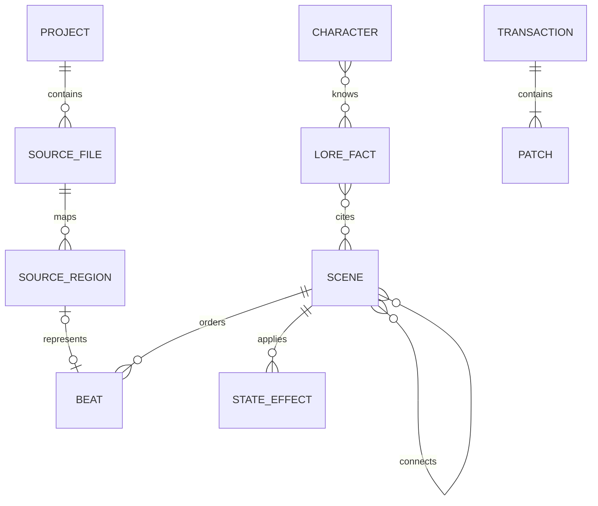

# Data model

## Authority and identity

Runnable truth lives in `.rpy` files. Editor metadata references source; it never
silently replaces it. Every supported visual object receives a stable editor UUID
mapped to a file revision/hash and source range. Human-authored Ren'Py identifiers
remain unchanged unless the user explicitly renames them through a reference-aware
transaction.

## Source layer

| Entity | Essential fields |
| --- | --- |
| Source file | project-relative path, byte content/revision hash, encoding, parse status |
| Source region | stable ID, byte/line range, tokens/trivia, supported kind, parent region |
| Custom-code region | exact text/range, surrounding anchors, reason unsupported, warnings |
| Diagnostic | SDK/version, file/range, severity, code/category, raw excerpt, remediation |

The parser must retain comments, whitespace/trivia, statement order, identifiers,
embedded Python, screen language, ATL, translations, and unknown syntax. Source
ranges are invalidated and remapped after each accepted revision.

## Narrative layer

| Entity | Essential fields |
| --- | --- |
| Project | ID, title, resolution, pinned SDK, roots, capabilities, schema version |
| Route/chapter | ID, name, ordered children, entry/exit references |
| Scene | ID, Ren'Py label(s), source regions, ordered beats, partial-visual flag |
| Beat | ID, type, source mapping, payload, timeline position, conditions/effects |
| Edge | source/target, kind, choice text, condition, call/return semantics |
| Asset | ID, project-relative path, media type, hash, usages, import provenance |
| Character | technical definition plus narrative profile and branch-aware current state |
| Variable | name/type/default/definition, reads/writes, range, persistence, category |

Beat types initially include scene/background, show/hide/move/expression/transform,
dialogue/narration, menu/choice, variable/conditional, call/jump/return/end, audio,
transition, ATL/movie, and custom code.

## Lore and state

A lore fact records subject, category, canonical text, characters who know it,
route applicability, valid game-day/time range, source scenes/decisions, contradictory
alternatives, provenance, review status, and last review/change. Status is one of
`proposed`, `approved`, `superseded`, or `rejected`.

State snapshots record provenance and whether they are reachable, saved-route, or
manual/synthetic. They contain variable values, prior decisions, day/time, known
facts, and source revisions. Contradictions are displayed rather than normalized away.

Initial variable categories are relationship, story flag, route state, day/time,
inventory, preference, and persistent unlock.

## Transaction model

Every manual, visual, source, and LLM edit becomes a transaction:

| Field | Purpose |
| --- | --- |
| ID and origin | Audit and undo grouping (`visual`, `source`, `LLM`, `external`) |
| Base revisions | Detect stale or conflicting writes |
| Semantic operations | Explain intent and support partial acceptance |
| Exact patches | Apply minimal byte/range changes and show file diffs |
| Validation result | Parser and optional SDK diagnostics before acceptance |
| Recovery state | Journal status, atomic-write outcome, undo/redo relationship |

LLM proposals also store provider/endpoint class/model, local-versus-remote status,
selected context references, token estimate, schema version, and individual proposal
items. Raw credentials and unnecessary full prompts do not enter project metadata.

## Metadata and migrations

`.renpy-editor/` uses explicit schema versions and project-relative forward-slash
paths. Migrations are deterministic, previewable, reversible when practical, and
backed up transactionally. Unknown fields are preserved. Metadata corruption cannot
trigger rewriting of authoritative `.rpy` source.

Exact production JSON schemas will be introduced with tests during the approved
Phase 1 vertical slice; the Phase 0 source-model decision is recorded in ADR 0001.
