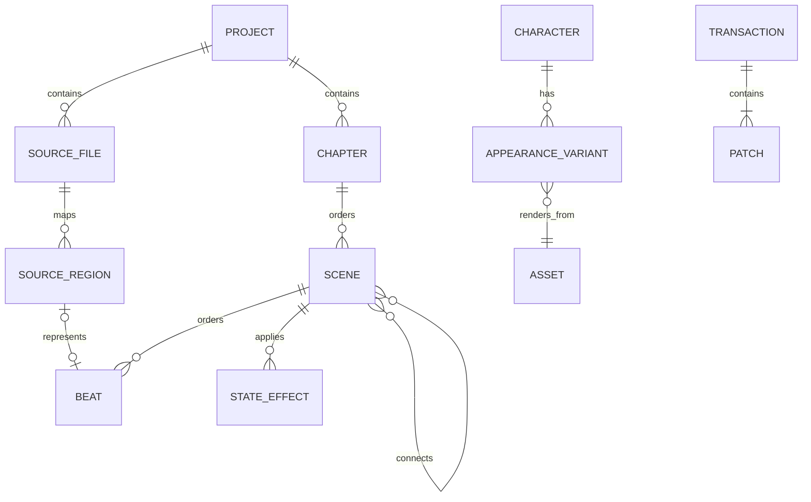

# Data model

## Authority and identity

Runnable truth lives in `.rpy` files. Editor metadata references source; it never
silently replaces it. Every supported visual object receives a stable editor UUID
mapped to a file revision/hash and source range. Human-authored Ren'Py identifiers
remain unchanged unless the user explicitly renames them through a reference-aware
transaction.

For Loomlight-created projects the authoring hierarchy is:

`Project → Chapter → Scene → Beat`

A Chapter is organisational. A Scene normally maps to one `.rpy` file and one primary
globally unique Ren'Py label; Branch edges connect scenes explicitly. Display names,
technical labels, filenames, and stable UUIDs are distinct identities so a cosmetic
rename does not create unnecessary source churn.



## Source layer

| Entity | Essential fields |
| --- | --- |
| Source file | project-relative path, byte content/revision hash, encoding, parse status |
| Source region | stable ID, byte/line range, tokens/trivia, supported kind, parent region |
| Custom-code region | exact text/range, surrounding anchors, reason unsupported, warnings |
| Diagnostic | SDK/version, file/range, severity, code/category, raw excerpt, remediation |

The parser must retain comments, whitespace/trivia, statement order, identifiers,
embedded Python, screen language, ATL, translations, and unknown syntax. Source
ranges are invalidated and remapped after each accepted revision. Unsupported or
ambiguous source remains in place and must not be coerced into a visual beat model.

## Project and narrative layer

| Entity | Essential fields |
| --- | --- |
| Project | ID, title, folder/path identity, resolution, pinned SDK, schema version, capabilities |
| Chapter | ID, display name, ordering, project-relative directory reference |
| Scene | ID, display name, technical label, source file/regions, ordered beats, partial-visual flag |
| Beat | ID, type, source mapping, payload, conditions/effects where supported |
| Edge | source/target Scene, kind, choice text, call/jump/return semantics |
| Asset | ID, project-relative path, media type, hash, usages, import provenance |
| Character | ID, technical variable, display name, dialogue colour, default appearance, definition range |
| Appearance variant | ID, character ID, attribute map, render mode, asset/render reference |
| Variable | ID/name, supported type/default, definition range, reads/writes, persistence/category |

Phase 1's visual Beat set is intentionally bounded to background/scene, show/hide
character, change appearance, placement/transform reference, dialogue, narration,
unconditional choice, jump, return/end, simple variable assignment, play/stop music,
play sound, transition reference, and custom/unsupported source region. Later phases
extend the same Beat/semantic model rather than replacing it.

## Characters and appearance

Character visuals are modeled as extensible appearance attributes, not as a filename
field on the Character. A typical future selection may be:

```text
outfit = university_uniform
pose = standing
expression = annoyed
```

Phase 1 exposes only `expression` in the normal UI; `outfit` and `pose` are implicit
`default` attributes. The schema must preserve an attribute map so later outfit, pose,
hairstyle, accessory, damage/state, or other dimensions can extend the model without a
migration from an expression-only architecture.

Phase 1 uses a static imported Asset as the render source. `render_mode` is designed to
admit later layered-image, animated, or other reviewed displayable strategies without
changing what a Scene beat references. Scene beats reference the appearance variant
(or an appearance selection), not a raw filename. Asset IDs remain stable if an asset
path is reorganised through a supported transaction.

The Phase 1 Character surface exposes technical variable, display name, dialogue
colour, default appearance, and an `Appearances` list. Adding an appearance imports/
copies an image into the project and assigns an expression name; filename inference may
prefill the name but is never authoritative.

## Assets

Phase 1 imports assets by copying them into the project so a Loomlight-created project
is portable and self-contained. Assets use project-relative paths and stable IDs;
external absolute references are not a Phase 1 authoring feature. Initial categories
include backgrounds, character appearance images, audio, and UI/project assets.
Duplicate/missing checks are required, while advanced tagging, conversion,
optimisation, search, and bulk management remain later work.

A conventional character layout may be:

```text
game/assets/characters/alice/neutral.png
game/assets/characters/alice/happy.png
game/assets/characters/alice/annoyed.png
```

The path is organisation, not identity.

## Variables and state

Phase 1 visual variables support `bool`, `int`, and `string` definitions with simple
assignment of a value the editor can represent. Arbitrary Python expressions remain
source/custom code until a later expression/state model can represent them safely.

A lore fact records subject, category, canonical text, characters who know it,
route applicability, valid game-day/time range, source scenes/decisions, contradictory
alternatives, provenance, review status, and last review/change. Lore remains a later
feature; its status vocabulary is `proposed`, `approved`, `superseded`, or `rejected`.

Future state snapshots record provenance and whether they are reachable, saved-route,
or manual/synthetic. They contain variable values, prior decisions, day/time, known
facts, and source revisions. Contradictions are displayed rather than normalized away.
Initial variable categories may include relationship, story flag, route state,
day/time, inventory, preference, and persistent unlock.

## Extensible staging and media references

Phase 1 does not create disposable special cases for basic VN staging:

- character placement references a transform/placement definition; the initial UI
  exposes Left, Centre, and Right presets;
- visual changes may reference transitions; the initial selector exposes a very small
  set such as None, Dissolve, and Fade;
- audio beats use typed action/channel/asset references sufficient for play/stop music
  and play SFX while leaving room for custom channels, ambience, voice, volume/pan,
  fades, and Timeline synchronization.

The UI subset may be narrow; the stored semantic model must remain extensible.

## Transaction model

Every manual, visual, source, and later LLM edit becomes a transaction:

| Field | Purpose |
| --- | --- |
| ID and origin | Audit and undo grouping (`visual`, `source`, `LLM`, `external`) |
| Base revisions | Detect stale or conflicting writes |
| Semantic operations | Explain intent and support future partial acceptance |
| Exact patches | Apply minimal byte/range changes and show file diffs |
| Validation result | Parser and optional SDK diagnostics before acceptance |
| Recovery state | Journal status, commit outcome, undo/redo relationship |

Short-lived edit buffers may group a natural typing burst into one transaction; they
are not a second authoritative document. Accepted transactions persist automatically
through the same source/file coordinator used by explicit `Ctrl/Cmd+S` flush.
Persistence state is surfaced to the user as Saved/Saving/Pending validation/Conflict/
Recovery required. External revisions stop stale undo/redo and writes rather than being
silently overwritten.

## Project lifecycle metadata

`.renpy-editor/` uses explicit schema versions and project-relative forward-slash
paths. Phase 1 metadata includes enough project identity, SDK/resolution configuration,
source mappings/stable IDs, recovery state, and workspace convenience state to close
and reopen the project safely. Last-open Scene/beat (if still valid), active centre
tab, panel collapse/split state, and preview zoom may be stored as editor convenience
without becoming game truth.

Migrations are deterministic, previewable, reversible when practical, and backed up
transactionally. Unknown fields are preserved. Metadata corruption cannot trigger
rewriting of authoritative `.rpy` source. Deleting `.renpy-editor/` must not stop the
game from running, but Phase 1 does not reconstruct missing metadata as a substitute
for the deferred arbitrary-project importer.

Exact production JSON schemas are introduced with tests during the approved Phase 1
vertical slice; the architectural source decision remains ADR 0001.
