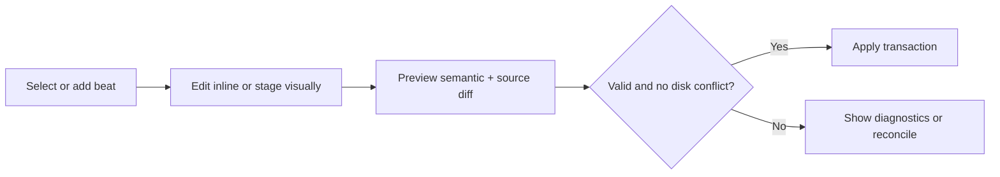
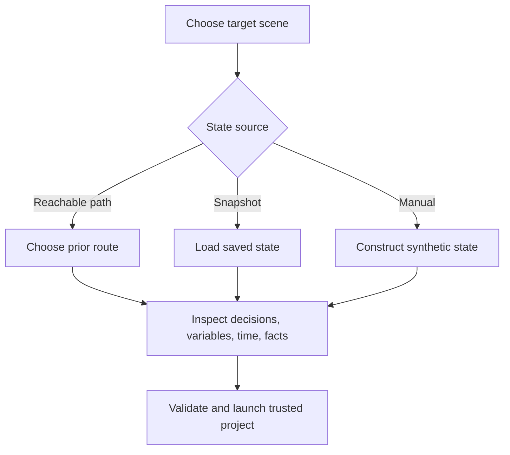

# UI checkpoint

## Design intent

Project Loomlight is a restrained, professional writing and game-authoring tool.
The game preview stays visually dominant. The initial theme is dark with a planned
light theme; meaning never depends on colour alone. Panels are keyboard reachable,
resizable, collapsible, and compatible with screen-reader semantics where the chosen
desktop/webview stack permits them.

## Application shell wireframe

| Region | Low-fidelity contents |
| --- | --- |
| Top toolbar | Project · save state · undo/redo · validate · preview · run from here · LLM locality/model · Git state |
| Left sidebar | Story · routes/chapters · scenes · characters · variables · assets · lore · screens |
| Centre tabs | Scene · Source · Branches · UI Designer · Timeline |
| Right inspector | Selection properties, validation, contextual character/lore tools |
| Bottom panel | Diagnostics · runtime · simulated state · Git changes · LLM operations |

The centre owns flexible space. Side and bottom panels collapse; a focused writing
preset keeps the beat list and dialogue broad, while staging and debugging presets
restore preview/inspector and diagnostics respectively. Advanced saved layouts wait.

## Scene workspace — default and first polished surface

| Left centre (compact) | Main centre (largest) | Right |
| --- | --- | --- |
| Ordered beats; add/reorder; type/icon plus text label; current beat | Live preview above; fast inline dialogue editor below; visual/split/source mode toggle | Selected beat properties; expression/assets; relevant character and lore context |

The beat list supports background/scene, show/hide/staging, dialogue/narration,
choice/control flow, state, audio/transition/animation, and custom code. Dialogue is
edited inline with character and expression shortcuts; routine lines do not open a
modal. Selecting a beat highlights its preview state, source range, graph position,
and timeline cursor. A partially visual badge names the unsupported source region.

## Source workspace

| Navigation | Editor | Inspector/bottom |
| --- | --- | --- |
| Files, symbols, scene/beat anchors | Syntax-aware source with mapped-range highlights and custom-code boundaries | Visual counterpart, diagnostics, staged patch, external-change conflict |

Source and visual selection are bidirectional. Source-only mode never hides whether
a range is supported. External edits are parsed against the last revision; supported
changes update visual views and overlapping changes enter explicit reconciliation.

## Branching workspace

| Controls | Graph canvas | Inspector |
| --- | --- | --- |
| Route/chapter/character filters; search; path mode; minimap toggle | Virtualized scene/label/choice nodes; expandable detail; conditioned edges | Reads/writes, reachability, incoming/outgoing paths, test-from-node |

The default graph excludes individual dialogue lines. Nodes expand on demand.
Diagnostics distinguish unreachable scenes, missing targets, non-returning call paths,
and contradictory/manual states with icon, text, and colour. Large-story requirements:
stable layout, progressive disclosure, scoped subgraphs, viewport rendering, search,
minimap, and highlighted reachable paths.

## Screen/UI designer

| Component hierarchy | Constraint canvas | Properties/source |
| --- | --- | --- |
| Frames, containers, text, images, buttons, bars, grids, viewports, components | Selected resolution/aspect preview with layout guides and interaction state | Layout/style/action fields; synchronized screen language; protected custom regions |

This is a hybrid hierarchy-and-constraint editor, not a freeform drawing canvas.
Preview states include normal, hover, selected, disabled, keyboard focus, long text,
missing assets, and configured window sizes. Standard VN screens start from editable
templates. Unsupported code stays at its source location and marks only the affected
screen region partially visual.

## Animation/audio timeline

| Track list | Time canvas | Inspector/transport |
| --- | --- | --- |
| Background; character layers; camera/transforms; effects; music; ambience; SFX; voice; dialogue; movie | Clips/events, keyframes, transitions, synchronized selected beat | Time/value/easing/media; play, scrub, loop; generated Ren'Py preview |

The timeline authors VN staging, not arbitrary video compositing. It emits supported
ATL, transitions, audio statements, and movie displayables. Original media is never
modified; conversion or optimization is explicit, previewed, and non-destructive.

## Character, lore, and variables

- **Character:** technical definition, sprites/expressions/voice, narrative profile,
  relationships, knowledge, arc/status, outfits/locations, and example dialogue.
  Scene-relevant details appear beside dialogue without leaving the scene.
- **Lore:** branch/time applicability, knowledge, contradictions, source provenance,
  proposal review, and exact LLM-context inclusion with token estimate.
- **Variables:** type/default/definition, descriptions, reads/writes, constraints,
  persistence, semantic category, and graph/state usage.

## State simulation and run from here

Reachable, saved, synthetic, and contradictory states use distinct text labels and
icons. Before launch the user sees effective variables, decisions, day/time, and
known facts. Development harness content is visibly non-release and cannot be packed
into a game distribution.

## LLM operation flow

LLM is an action surface, not a permanent dominant chat. Before send, show provider,
endpoint class, model, local/remote status, selected context and exclusions, estimated
size, and a warning for private/adult content leaving the machine. After response,
show schema/validation status, semantic changes, file diffs, and independent accept,
reject, or partial-accept controls. No content is sent or applied automatically.

## Resolution and accessibility checks

- Author at project resolution (default `1920×1080`) while previewing alternative
  window sizes/aspects without changing canonical project settings.
- Full keyboard traversal, visible focus, labelled controls, logical reading order,
  resizable text/panels, and reduced-motion behavior are acceptance requirements.
- Beat/status colour has an accompanying icon and label. Contrast is tested in both
  themes. Canvas-only information has an equivalent hierarchy/list representation.
- Narrow windows collapse peripheral panels before constraining dialogue readability.

## First vertical-slice UI

Phase 1 focuses on project setup, two characters/assets, modular scene beats, inline
dialogue and staging, one choice with two destinations, a basic branch graph,
synchronized source, external/custom-code preservation, SDK diagnostics/preview, and
a Git checkpoint. Designer/timeline tabs may initially communicate planned scope but
must not pretend to be functional.
