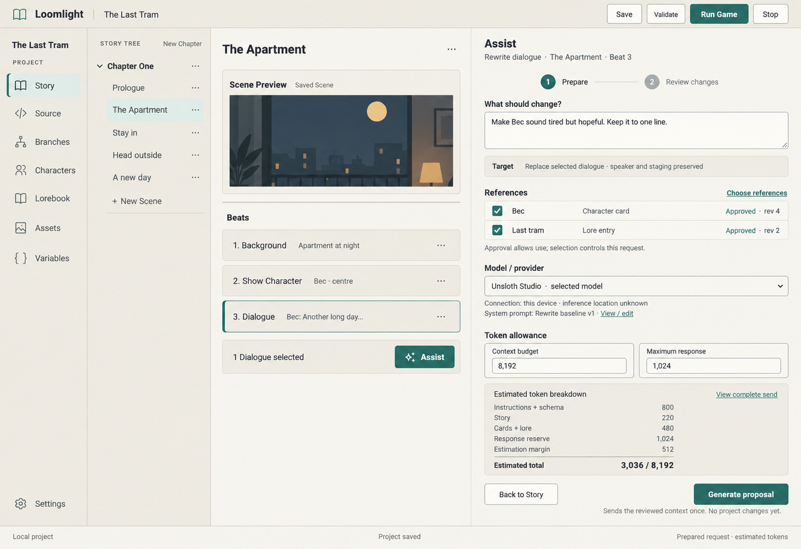
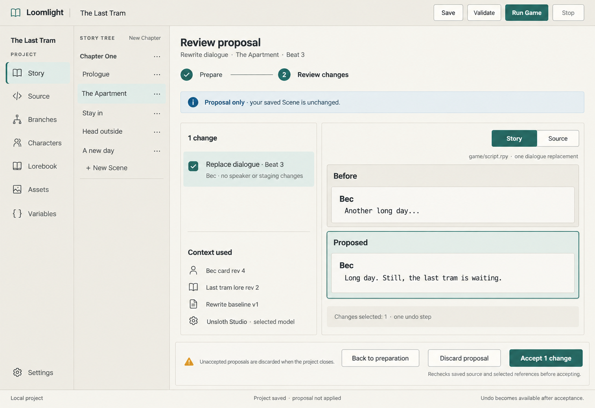
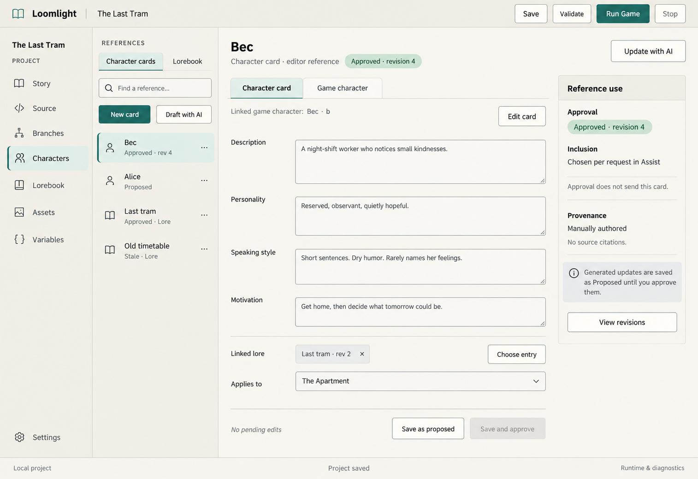
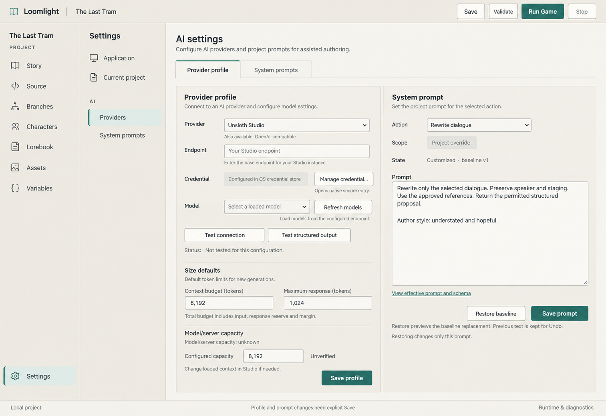

# Proposed Phase 2 LLM screen references

Generated 2026-10-02 with the built-in imagegen tool. These four concepts extend the
saved actual Story screenshot using the synthetic The Last Tram fixture, with the
accepted Settings and Characters images as structural references. The host was locked:
no live capture or claim about current uncommitted Phase 1 work is made. No private
game content or credentials were used. The saved actual screenshot remains ignored
local evidence; the generated assets below are unchanged project copies.

The [Phase 2 LLM interaction design](../../tasks/active/phase-2-initial-llm-assistance.md#18-proposed-llm-screen-and-interaction-design)
owns behavior and acceptance; sections 5–9 of that brief own provider, size, prompt,
transaction and reference contracts. These are **proposed, not accepted or implemented**
screens. The [existing UI references](../ui-refresh/README.md) still own shell,
palette, shared controls and accessibility. Their old purple colors were explicitly
excluded from generation; use the actual paper/teal and charcoal/copper theme tokens.

| Concept | Purpose | Exact generation prompt |
| --- | --- | --- |
| [Prepare rewrite](prepare-rewrite-light-v1.png) | Selected target, task, approved/current references, complete-send entry and total token allowance. | [Prompt](prepare-rewrite-light-v1.txt) |
| [Review rewrite](review-rewrite-light-v1.png) | Whole semantic operation selection, before/proposed comparison, Source view and explicit acceptance. | [Prompt](review-rewrite-light-v1.txt) |
| [Reference editor](references-light-v1.png) | Manual Character-card editing, linked lore, provenance and approval separate from per-request inclusion. | [Prompt](references-light-v1.txt) |
| [AI settings](ai-settings-light-v1.png) | Required providers, native credential affordance, total context/response defaults and versioned prompt editing/reset. | [Prompt](ai-settings-light-v1.txt) |

## Preparation

Preserves the recognizable two navigation columns, current Scene/Beat context and a
bounded Assist preparation form. Both approved references are explicitly selected;
total arithmetic is 800 + 220 + 480 + 1,024 + 512 = 3,036. Counts are illustrative
estimates, not measured token usage. “Selected model” is a placeholder; implementation
shows the exact configured ID and qualified readiness before sending. The generated
night artwork is illustrative, not a bundled asset or proof of a live game preview.
View complete send opens the exact immutable payload; this image does not show it.

## Review

Shows one whole replacement operation, readable old/new prose and separate Story/Source
views. The project remains unchanged before acceptance. Multi-file and dependency
groups need the written flow; this image demonstrates the simple rewrite only.
“Undo becomes available after acceptance” means undo of this new accepted operation;
existing project history remains available. Proposal lifetime is transient, including
discard on project close/switch, with an actual warning/choice in implementation.

## Reference editing

Distinguishes approved revision, request inclusion and manual provenance, with a linked
lore entry. This shared-editor concept shows a card; the plan explicitly specifies the
Lorebook title/text/category/scope/citation editing and approval journey too.

Schematic details require these implementation corrections: the selected Character
cards tab filters cards rather than listing lore; the mixed list merely illustrates
record types/statuses. Idle records are read-only until Edit and both Save actions are
disabled with no pending edits (the image only dims one). Form-shaped boxes do not
imply editable approved text. “Generated updates are saved as Proposed” means after
explicit review and Save as proposed/acceptance, never automatically on generation.
Saved proposed records persist without being approved; raw unsaved proposals do not.
View revisions is bounded reference revision/provenance inspection, not a persistent
raw prompt/reply archive.

## AI settings

Shows only Unsloth Studio and generic OpenAI-compatible choices, a native credential
management affordance, untested configuration, unknown server capacity, total budget
versus response ceiling, and a customized prompt with baseline version/Restore baseline.

The simultaneous provider/prompt panes are an overview of both editors; actual tabs
show only the selected editor. Machine profile and project prompt scopes stay explicit.
“Load models from the configured endpoint” below Refresh models must become “List
models loaded in Studio”; Loomlight does not load models. Prompt text is abbreviated
author-editable illustration; schema/permissions remain core-owned, and project style
notes have a separate field. Restore baseline opens the comparison before applying;
Cancel, saved restore, Undo and reopen are written requirements, not pictured evidence.

## Provenance and limits

[manifest.json](manifest.json) records mode, date, original generated filenames,
unchanged-copy SHA-256 hashes, dimensions, exact prompt files and reference hashes.
Four generation calls produced these four selected outputs, with no retries or edits.
Every output was visually inspected for readable hierarchy, shell/palette continuity
and the behavioral labels above. Generated typography, gradients, icon geometry,
disabled styling and spacing are approximate and do not supersede shared controls.

Only wide light-theme idle/preparation/review states are shown. Dark/narrow/scaled
layouts, keyboard/native credentials, errors, busy/cancel, draft guards, stale rejection,
exact payload dispatch, source acceptance and persistence require real implementation
checks. No configured project LLM provider was contacted or capability qualified; only the
built-in image-generation tool was used. Mockups are not runtime,
accessibility or target acceptance evidence.
