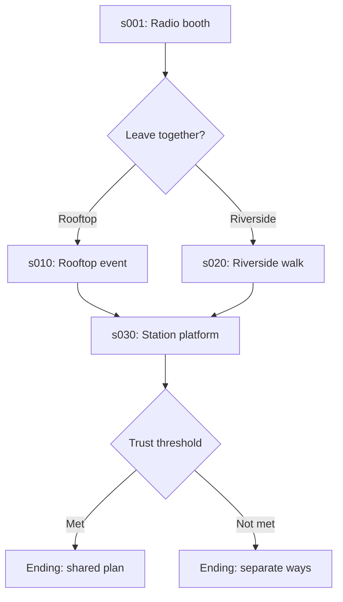

# Representative fixture-game proposal

## Purpose

Create a small synthetic visual novel, working title **Crossroads at Sundown**, that
exercises source preservation, visual authoring, branching/state, screens, media, SDK
validation, and future LLM context without using real people, private game content, or
copyrighted assets. It is a test instrument, not a product demo or writing sample.

## Story shape

Two fictional adult colleagues, Alex Rowan and Morgan Vale, finish a community-radio
shift and choose whether to attend a rooftop event or take a quiet riverside route.
Both paths change relationship/trust and time, reveal route-specific facts, and
reconverge before one of two endings. Neutral subject matter keeps fixtures suitable
for logs and screenshots; a separate synthetic metadata case asserts that adult-
content flags are preserved without application filtering, without containing graphic
material.



## Proposed project layout

```text
tests/fixtures/crossroads-at-sundown/
  game/
    script.rpy
    definitions/{characters,variables,transforms}.rpy
    chapters/chapter_01/{scene_001,scene_010,scene_020,scene_030}.rpy
    screens/route_status.rpy
    systems/development_harness.rpy
    tl/es/fixture_strings.rpy
    assets/README.md
  .renpy-editor/
    project.json
    graph.json
    lore.json
  expected/
    source-manifest.json
    diagnostics/
    patches/
```

The exact schema and file names remain proposals until source/order spikes. Assets are
tiny original geometric placeholders produced in-repository with recorded generation
instructions; no downloaded art, fonts, music, or personal voices.

## Coverage plan

| Fixture area | Coverage |
| --- | --- |
| Scene 001 | comments, scene/show/with, dialogue, interpolation/text tags, audio, two-way menu, state writes |
| Rooftop | call/return, ATL transform, ambience/SFX, condition, branch-only lore |
| Riverside | layered/staged images, queue/stop audio, embedded Python calculation, route-only knowledge |
| Reconvergence | reads/writes, trust gate, two endings, unreachable diagnostic variant |
| Screen | containers, text, image button/action, condition, hover/focus/disabled, protected custom region |
| Translation | non-ASCII text and translated strings while preserving source identifiers |
| Custom code | custom statement, `init python`, unsupported displayable, unusual but valid formatting |
| Recovery set | deliberately incomplete/malformed copies stored outside runnable game inputs |
| Media manifest | image/audio/video filenames and missing/duplicate/case-collision diagnostic variants |
| Editor metadata | stable IDs, graph positions, branch-aware lore, state snapshots, provenance/status |

## Golden variants

- `original`: exact authored bytes, including mixed quote styles and purposeful comments.
- `noop`: expected byte-identical round trip.
- One expected minimal patch per Phase 1 edit type.
- `external-non-overlap`, `external-overlap`, and `unsupported-neighbour` revisions.
- LF, CRLF, Unicode-path, and incomplete-edit microfixtures kept separate so Git line
  normalization does not invalidate byte tests; package them as binary golden data if
  necessary.

Each source manifest records SHA-256, encoding, line ending, expected SDK result, and
whether the file is runnable, intentionally invalid, or parser-only.

## State and lore examples

Variables include `trust` (relationship integer), `route` (enum-like string), `day`
and `time_of_day`, `heard_rooftop_news`, and a persistent ending unlock. Lore includes a
public station fact, rooftop-only information known by Morgan, and two contradictory
route outcomes with source scenes and validity ranges. Saved state variants cover a
real rooftop path, a real riverside path, and an explicitly synthetic contradictory
test state.

## Acceptance criteria

- All valid fixtures compile and lint under the pinned official SDK; intentionally
  invalid fixtures produce expected structured diagnostics and are never built.
- No-op golden comparisons are byte-identical. Minimal patches alter only manifested
  ranges. Unsupported regions remain byte-identical and at the same source location.
- Generated projects run without `.renpy-editor/`; deleting metadata changes no game
  behavior. Development harness content is excluded from distribution builds.
- All assets/content are synthetic, licence-safe, and pass the repository privacy scan.
- Fixture complexity stays small enough to diagnose a failed construct independently.

## Implementation status

The Phase 0 parser corpus and integrated source skeleton now exist under
`tests/fixtures/crossroads-at-sundown/`, with SHA-256/byte metadata and encoded BOM/
CRLF cases. No binary assets were added. The integrated game passes official Ren'Py
8.5.3 compile, strict lint, automated test, normal-run, development-warp, and PC-build
gates on Linux, Windows x64, and macOS ARM64 in final target run 34731460283.
