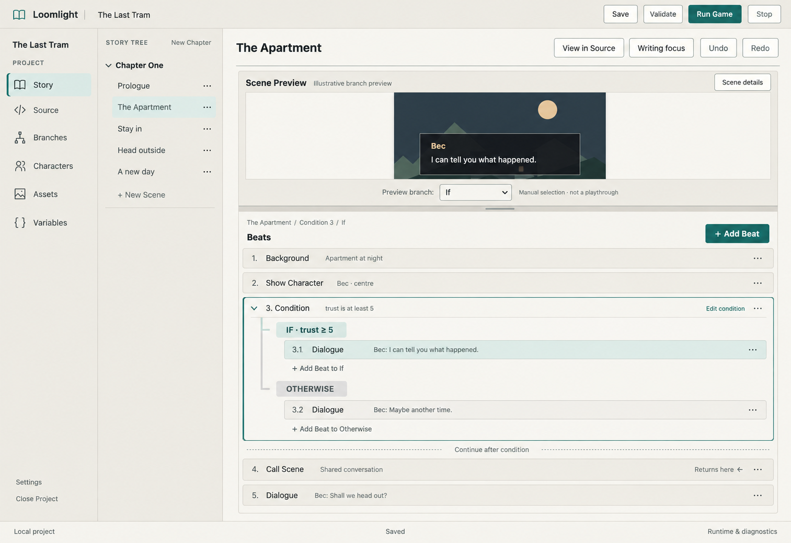

# Phase 3 — Initial WYSIWYG release

**Planning date:** 2026-10-02. **State:** researched implementation-plan draft;
implementation `not_started`.
**Latest user direction:** accept only native Ren'Py video/animation formats at this
stage, with no conversion; 3C explicitly covers character drag/resize, pre-rendered
playback and dialogue-time idle loops. Earlier direction removed 3E/Git and requested
implementation research. Plan the
implementation of the remaining Phase 3 parts using Ren'Py documentation and relevant
projects as references. Earlier outcome-level planning was not a complete implementation
plan. The steps below supply a proposed technical approach and proof checkpoints;
research is not SDK qualification or approval to start coding.
**Sequence:** selected staged overlap brings bounded 3A source foundations forward
and completes 3A alongside remaining Phase 2 work after the first safe rewrite.
Story logic precedes Screens; Screens and Timeline then use two implementation lanes.
[The Phase 2 delivery section](phase-2-initial-llm-assistance.md#19-selected-shared-foundations-and-two-lane-delivery)
owns the shared sequence/team. Exact feature subsets remain reviewable.
**Owner:** this brief owns Phase 3 capability boundaries and acceptance planning;
[ROADMAP](../../ROADMAP.md) owns the overall sequence, and
[PRODUCT](../../PRODUCT.md) retains the initial-release commitment.
**Entry:** accepted/integrated Phase 1 including 1H, fresh refs/implementation
inspection and selection of a bounded outcome. Minimum 3A source foundations may be
selected before Phase 2 completion; remaining 3A follows the first safe Phase 2 rewrite.
3B/3C require accepted Phase 2 and 3A. 3D follows its qualified semantics/effects, and
3F retains all milestone acceptance dependencies. These are scoped entry conditions,
not approval to implement every checkpoint.
Planning can continue now. No implementation, integration, release or new CI dispatch
is selected by this document.

## 1. Outcome and first usable results

An author can build branching story logic, design supported game screens, time VN
staging/audio, inspect a supported starting state and run from it, then save
and reopen the game. Visual changes remain ordinary Ren'Py source, editable outside
Loomlight and runnable without editor metadata.

Phase 3 is substantially larger than Phase 2. Deliver reviewable capabilities along
the way; do not hide the first usable result behind completion of every workspace.
The selected delivery overlap above governs implementation; the table below names
capability completion boundaries rather than a strictly serial execution order.
No calendar estimate is committed before the source/SDK feasibility checks.

| Checkpoint | First usable result | Completion boundary |
| --- | --- | --- |
| 3A — Story logic | A variable changes which choice is available; a called Scene returns to its caller. | Supported conditions/calls agree across Story, Source, Branches and actual runtime. |
| 3B — Screen designer | Edit one supported screen using hierarchy, canvas and properties, then inspect it in Ren'Py. | Declared screen subset, reusable supported components, source reconciliation and accessible editing pass. |
| 3C — Staging, native animation and VN Timeline | Drag/resize a character; play a supplied native animation, including an idle loop during dialogue; animate transforms and schedule music/SFX. | Declared placement/media/timing/transform/channel subset survives Source edits, undo and reopen and matches native SDK output; no import conversion. |
| 3D — State and Run From Here | Inspect one explicit route's effective state and start at a supported point. | Provenance, unknown-state refusal, call-stack constraints and isolated launch behavior pass. |
| 3F — Release acceptance | Install on both supported targets and finish the integrated authoring workflow. | Agreed product coverage, distribution channel, applicable signing and release evidence are complete. |

**3E is removed.** Local Git and GitHub remain deferred optional work, outside this
phase and initial-release acceptance. Retain 3F's existing ID for traceability; it is
release qualification, not another creative feature. Existing project-creation Git init
is unchanged. Repository development commits are unrelated to this product deferral.

Each checkpoint may use internal implementation/review/test commits in the same chat.
WORKFLOW governs pauses and independent review; these rows do not mandate a chat per
commit or authorize the entire phase as one goal.

**At the end of Phase 3:** build a richer playable visual novel using supported
conditions/calls, editable game screens and timed staging/audio; inspect and launch
from a supported story state; save/reopen your work; and install a
qualified initial-release editor on Windows x64 and macOS ARM64. Unsupported Ren'Py
still remains editable as source, with visual limitations shown. Phase 3 builds on
Phase 2's cards, lorebook and reviewed generation rather than replacing them.

## 2. Dependencies and compatibility

- 3A establishes shared condition/call semantics before 3D uses them. Branches keeps
  its observed saved-state contract; it does not become a second source of truth or
  claim complete reachability analysis.
- 3B and 3C reuse accepted source mapping, transactions, assets and history. After
  accepted Phase 2/3A they may run in separate implementation lanes, with one owner
  assigning shared-file writers and integrating their source/runtime contracts.
  Story logic remains before Screens; runtime comparison uses one shared job service.
- 3D must account for supported visual/audio effects from 3C or explicitly refuse
  unsupported entry points. A successful jump is not proof of reconstructed state.
- [Optional Git](optional-local-git.md) has no dependency edge into Phase 3 or 3F.
- Phase 2 assistance stays on its accepted operation allowlist. New conditions,
  screens or Timeline syntax do not automatically become LLM-editable. Excluded
  regions and unknown effects remain visible in selected context.
- Phase 4 broader analysis and Phase 5 open-world state are not prerequisites for
  honest, bounded Phase 3 support. Do not infer day/time, character knowledge or
  arbitrary Python state merely because later UI designs mention them.

### Inspected implementation seams

The inspection baseline is this planning branch's inherited application tree at
`de2fdad`; active Phase 1 changes and future Phase 2 interfaces must be reconciled at
implementation entry. Proposed new module names below are design suggestions, not
existing APIs. Keep the current Rust core / TypeScript / Tauri stack.

| Existing code | Finding and implementation consequence |
| --- | --- |
| [scene.rs](../../../app/src-core/src/scene.rs), `BeatPayload`, `parse_scene`, `is_terminal_payload` | Current Beats are flat, menu recognition expects unconditional jump destinations, and Choice is terminal. Nested conditions, menu fallthrough and returning calls require a structural extension, not just new form fields. |
| [source.rs](../../../app/src-core/src/source.rs), [metadata.rs](../../../app/src-core/src/metadata.rs) | Source ranges currently identify Scene/Beat ownership; project/source-map schemas are version 2. Add typed nested/screen/transform locations and an explicit migration while preserving byte offsets versus editor positions. |
| [scene/flow.rs](../../../app/src-core/src/scene/flow.rs) | Extend this observed projection with condition/call/continuation information; do not build a separate graph store or reinterpret cached edges as write authority. |
| [scene-ui.ts](../../../app/src/scene-ui.ts), `deriveScenePreview` | Current preview is a scene-local TypeScript projection. Keep a lightweight renderer, but put new shared expression/state semantics in core rather than creating different truth in each workspace. |
| [transaction](../../../app/src-core/src/transaction), [dispatch.rs](../../../app/src-core/src/dispatch.rs) | Reuse revision checks, history/recovery, session ownership and cancellable background work. New screens/transforms use the same prepared-mutation path. |
| [lifecycle/runtime.rs](../../../app/src-core/src/lifecycle/runtime.rs), [renpy/runtime.rs](../../../app/src-core/src/renpy/runtime.rs), [runtime-preparation.ts](../../../app/src/runtime-preparation.ts) | Current runtime supports Run/Validate and deliberately disables developer/console/autoreload in controlled play. Preview/Run From Here need explicit typed runtime purposes, not a hidden weakening of normal Run. |

**Common implementation sequence:**

1. Add a bounded lexical/block layer over exact bytes, using existing lexical helpers
   where suitable. Track indentation, strings, comments and opaque child ranges; no
   regex script rewriting or project Python execution. Keep unsupported parents opaque
   when safe child boundaries cannot be established.
2. Extend source-derived typed models and mapping metadata with stable identity, node
   kind and parent/range information. Prove migration/no-op reopening of existing
   projects before any new surface writes; only metadata requires migration, not a
   rewrite of ordinary existing scripts. Reject unsupported newer schemas cleanly.
3. Expose narrow read/prepare/apply commands through the existing protocol. A gesture
   holds a temporary UI draft and commits one reviewed/revision-bound change on release
   or confirmation. Cancel/Escape, external edits or stale sessions retain input and
   write nothing. Structural edits cannot consume protected neighboring ranges.
4. Implement one real operation through renderer → dispatch → source preparation →
   transaction → reopen before building a whole workspace. The early shared source
   slice precedes expanded Phase 2 proposal planning; 2C.1 extends its preparation
   seams and later 3A/3B/3C controls reuse them. Preserve domain validation and the
   existing transaction layer rather than building a separate AI patching system.
5. Add a shared explicit preview job: frozen accepted inputs, reviewed executable
   trust, isolated scratch project/profile, typed result and original-source mapping.
   The proposed preview uses a separate Ren'Py window on both targets; native window
   embedding is not a prerequisite. No automatic execution on selection or editing.

Record a focused ADR for the nested mapping migration and the scratch preview/runtime
boundary at their implementing checkpoints. Confirm font asset discovery/import needs
for Screens before extending the existing media allowlist. Long preview/render/SDK
work releases authoring ownership; only snapshot/precondition/commit work holds it.

## 3. 3A — Richer Story logic

**Proposed first subset:** conditions over existing bool/int/string variables using
typed literal comparisons and bounded boolean combinations; conditional choice
availability and explicit conditional branches; Scene call/return with an explicit
return point. Preserve exact integer precision. Parameterized calls, arbitrary
expressions, dynamic labels, Python evaluation and unbounded recursion are outside
the first subset pending a separate decision.

First write down the expression grammar, type/error rules, nested-block ownership,
source mappings and call/return behavior. Check these against the pinned official SDK
before promising a source format. Design the editing UX with small examples before
implementation. All edits use minimal source patches and shared transaction/history.

**Completion checks:**

- A synthetic two-route story chooses the expected option for each tested variable
  value; boundary values and missing/type-mismatched definitions are diagnosed.
- A called Scene returns to the correct continuation, including a bounded nested-call
  example. Jump, call and return remain distinct in graph navigation and diagnostics.
- Story-to-Source and Source-to-Story edits agree; unsupported expressions, comments,
  formatting and custom blocks survive unchanged. Partial/unknown conditions are
  never silently treated as false or as unreachable paths.
- Undo/redo, external-edit conflict, failed acceptance and close/reopen preserve the
  accepted source and input. Tests assert branch/runtime outcomes, not just labels.

**Early risk proof:** exercise a real nested source edit and call/return through core
dispatch and the pinned SDK before building the full condition-editor UI.

### Story interaction design

**Proposed 2026-10-02, not yet accepted or implemented.** The user requested UI/UX
planning and a generated image based on the current UI. Keep Story as the familiar
writing surface: preview above an ordered Beat outline, existing scene tree, inline
forms and shared Save/history/status behavior. Add structure only when the author
adds logic. A simple dialogue scene should look and feel as it does today.

[Reference and generation provenance](../../design/phase-3-story/README.md).
This uses a saved actual UI screenshot, not live Phase 1 work. The image demonstrates
3A; the written interaction rules below take precedence over generated details.

**Example author journey:** select Add Beat → Condition, choose `trust`, “is at least”,
and `5`, then confirm once. Story inserts one expandable condition group. Add Bec's
“I can tell you what happened” dialogue to If and “Maybe another time” to Otherwise.
Continue below the group with Call Scene → Shared conversation, then another dialogue.
The group makes mutually exclusive content visible without requiring a graph editor.

| Author action | What the UI does |
| --- | --- |
| Read or collapse a condition | Label the group with its condition in plain language. Show If, ordered Else If branches, and Otherwise with indentation and a subtle nesting rail. Collapse to condition and branch/Beat counts; preserve selection and input. Outline numbers locate content, not execution order. |
| Create/edit a condition | Use typed variable/operator/value controls. Offer “All of” / “Any of” / “Not” for supported combinations, with an optional read-only source expression. Show missing variables and type errors beside the relevant field. Add Else If and Otherwise explicitly; keep branch order visible because the first matching branch wins. |
| Write inside a branch | Keep the ordinary inline Dialogue/Beat form. A breadcrumb identifies Scene / Condition / Branch. “Add Beat to If” names the insertion parent. Top-level Add Beat shows its exact insertion location before confirmation; it never guesses nesting from the selected row. Confirm new Beats once and return a collapsed saved row. |
| Reorder or move content | Up/down moves within the current body. “Move to…” selects an explicit parent branch and position, with a readable destination before apply. Provide keyboard equivalents. Moving a group moves its whole subtree; prevent moving it into itself. Dragging is optional, never the only path. One accepted move is one undo operation. |
| Continue after a condition | Show a non-editable “Continue after condition” structural separator at the parent indentation. Only branches that fall through reach it; show Jump/Return endings explicitly. If no Otherwise exists, a no-match path continues. Do not present the separator as a runnable Beat. |
| Add conditional choices | Keep the existing option editor, adding an optional “Available when…” condition and readable badge on each option. Explain where execution continues if no options are available. Distinguish unavailable, available and unknown with text; unknown is never silently disabled as false. |
| Call another Scene | A compact Call Beat names the target and says “Returns to next Beat”, with navigation to that continuation. Opening the target retains a back-to-caller breadcrumb; it does not expand or copy the target's contents inline. Keep Jump and Return visually and semantically distinct. Missing targets get an actionable diagnostic. |
| Inspect a branch preview | Offer a manual branch selector labelled “Illustrative branch preview” and “Manual selection · not a playthrough”. Keep the chosen branch separate from editing selection. Require a choice at ambiguous forks; never run both bodies in source order or infer actual state. Unsupported effects yield a partial/unknown preview. Evaluated route state arrives in 3D. |
| Cancel, collapse or navigate with a draft | Keep typed input and existing commit/cancel navigation protection. Collapsing a group with active input must not hide it silently: retain the editor or provide a visible draft marker and return action. Save status describes persisted source separately from unsubmitted form input. |
| Delete a group | Show the group's condition and contained Beat count. Explicitly distinguish deleting the entire group from unwrapping one selected branch; do not silently concatenate mutually exclusive bodies. Preserve the existing transaction/revision checks and undo. |

**Writing comfort and accessibility:** preserve Writing focus and the scene/branch
breadcrumb; do not add a mandatory right inspector for ordinary dialogue. Preview
resizes using the accepted accessible divider, without the redundant slider. On
narrow windows collapse the scene tree and wrap controls; cap visual indentation and
offer “Focus this branch” with an ancestor breadcrumb for deeper nesting. This changes
presentation, not stored nesting or scope. Provide labelled disclosure controls,
visible keyboard focus and text labels as well as color. Use existing light/dark theme
tokens and shared button sizing. Do not reduce dialogue text to fit more branches.

**Implementation connection:** 3A.1/3A.2 expose stable parent/branch identities and
continuation information. 3A.3 renders that outline and dispatches explicit insert,
move, unwrap and condition edits through the shared transaction layer. View state
(collapse, focus, manual preview route) must never rewrite source. Reconcile external
edits by stable identity; if a draft's owner changes or disappears, retain its text and
show a conflict rather than transferring it to another branch.

**UX proof within 3A.3/3A.4:** create the example above with mouse and keyboard; edit
both dialogues; add an Else If; move a Beat between bodies; collapse/reopen; cancel and
undo; reopen the project; then inspect an ordinary external edit while a child has a
draft. Verify actual source ownership and draft preservation, not only screen labels.
Check light/dark, laptop/wide layouts, Writing focus and deep nesting without horizontal
overflow. Validate both trust outcomes through deliberate normal Ren'Py execution;
manual editor preview alone cannot pass the runtime gate.

### Implementation plan

| Step | Concrete implementation | Proof before proceeding |
| --- | --- | --- |
| 3A.1 — Expressions and nested source | Introduce a typed expression tree in core: bool variable/literal, same-type equality/inequality, integer ordering, `not`, `and`, `or`, parentheses. No calls, attributes, indexing or evaluation of Python text. Add nested conditional blocks with ordered `if`/`elif`/`else` bodies to the source-derived Beat model. | Exact-byte no-op corpus, edits within one nested child, comments/Unicode/newlines, bounded depth/node counts, type errors and unknown expressions. Check SDK behavior for the emitted subset. |
| 3A.2 — Flow and persistence | Add conditions to choice options and a nonterminal Call Beat with a stable collision-checked `from` label. Preserve existing return labels on edits. Model possible continuation after a conditional menu; replace the blanket terminal-Choice rule with block-aware completion checks. Extend map migration, history and observed graph using the same model. | Old Phase 1 fixtures reopen unchanged; all-false menu continues as Ren'Py specifies; called Scene returns to the following Beat; nested calls and remove/undo retain correct destinations. |
| 3A.3 — Story controls | Add a variable/operator/value condition builder, nested branch rows, condition badges on options and a Call Scene picker. Support keyboard insert/move and explicit moving across block boundaries. Branches shows guarded/call/continuation edges with navigation to the exact source. | One edit through actual frontend/core dispatch, coherent Source/Story/Branches, cancellation and pending input retention, useful missing/type-mismatch diagnostics. |
| 3A.4 — Qualification | Run a small branching fixture through normal entry with multiple variable cases and two call sites, including save inside a called Scene and return after a safe surrounding edit. | Actual route/value/return assertions, no-op/minimal-patch regressions and both affected native targets. Stable `from` labels do not promise arbitrary save compatibility after script changes. |

Recommended first scope excludes parameterized/dynamic calls and while-loop authoring.
Already existing custom forms stay lossless. Add an explicit final Return/Jump where
the authored block requires one; never make an all-false conditional menu silently
fall into another Scene. A selected trace used in 3D will account for actual guarded
continuations; 3A's overview graph does not infer that every displayed path is reachable.

Ren'Py basis: [conditions](https://www.renpy.org/doc/html/conditional.html),
[conditional menus](https://www.renpy.org/doc/html/menus.html), and
[calls/return labels](https://www.renpy.org/doc/html/label.html#call-statement).

## 4. 3B — Supported screen designer

Use the canonical [UI direction](../../UI.md#screenui-designer): hierarchy plus a
constraint canvas, property editing and synchronized screen source. Proposed first
slice: one editor-created screen containing containers, text, image and a button,
with explicit position/size/alignment and a small allowlist of actions. Follow with
the reviewed initial-release subset for styles, bars, grids, viewports and reusable
components. The exact property/action inventory is a design deliverable, not assumed
support for every Ren'Py screen-language feature.

Start with a disposable custom screen. Choose which conventional generated game
screens may be edited only after proving safe ownership and round-trip mapping;
do not rewrite the full generated screen file. Arbitrary existing-project import,
dynamic screen Python, unrestricted actions and complete WYSIWYG fidelity are excluded.

**Completion checks:** create/edit/reorder supported nodes through canvas and keyboard
hierarchy; compare the selected layout and interaction states against real Ren'Py at
the chosen resolution and a second supported aspect. Reconcile a supported Source
edit; preserve an unsupported neighboring block and show partial coverage. Undo,
resize, external conflict and reopen must preserve the same source intent. Buttons
preview as inert controls in the editor; runtime actions require deliberate execution.

**Early risk proof:** round-trip one nested screen with an opaque neighboring region
and compare its actual SDK rendering before committing to the general canvas design.
Record supported properties and visible approximation limits alongside the result.

### Implementation plan

**Recommended release inventory:** screen roots; fixed/frame/window/vbox/hbox/grid
containers; text, image/add, textbutton/imagebutton, bars and viewports; selected
layout/text/color properties; simple styles and `use` of an explicitly owned component.
Show/Hide/Return and typed variable-setting actions form the first action builder.
Game-menu actions are selected by template adapters, not arbitrary Python entry.

| Step | Concrete implementation | Proof before proceeding |
| --- | --- | --- |
| 3B.1 — Screen source service | Add proposed core `screens` service with declaration inventory, typed nodes/properties, source spans and protected opaque children, using the shared block/mutation layer. New screens get a collision-checked owned file; existing screens are edited in place, not duplicated under a new definition. | One nested custom screen containing an unsupported neighbor round-trips and accepts a minimal property edit through the transaction layer. |
| 3B.2 — Canvas, tree and inspector | Add proposed `screen-ui.ts`: synchronized hierarchy and canvas selection, drag/resize/snapping plus numeric and keyboard editing, typed asset/style pickers, action builder and inert hover/selected samples. Store editor layout/selection metadata only; renderable properties remain in source. | Drag is one undo entry; Escape cancels; parent layout rules constrain child movement. Distinguish absolute pixel coordinates, relative coordinates and anchor values rather than coercing every drag into `xalign`/`yalign`. |
| 3B.3 — Real game screen adapters | Add schema-aware adapters for the pinned generated `say`, `choice`, main-menu/navigation, preferences and save/load templates. Expose supported layout/style slots while preserving required parameters/IDs, action bindings and dynamic list/slot logic. Support reused components by explicit owned definitions. | Change dialogue box/name placement, choice styling and menu layout in a generated project; continue dialogue, choose a route, change a preference and save/load normally in the SDK. Unsupported template versions fall back to source. |
| 3B.4 — Preview and completion | Use the shared scratch preview job with synthetic `who`/`what`, menu choices and other template inputs. Compare supported layout/hit targets against actual Ren'Py, plus full-game screen integration. Offer an explicit rerun after edits. | Native fonts/scaling/focus at project resolution and a second aspect, accessible tree/property operations, Source edit/reconcile, undo and reopen. Record preview approximations; browser geometry alone cannot qualify native output. |

Candidate file conventions are `game/ui/<screen>.rpy` for new screens and a dedicated
owned style file, finalized against actual generated projects. Do not replace all of
`game/screens.rpy` or claim every arbitrary screen is editable. `say`/`choice` template
bindings are protected semantic slots; parameters are not editable runtime variables.
For save/load and other dynamic screens, the editor uses sample items, clearly marked.
Font import uses project-owned assets and typed core handles, not arbitrary CSS URLs.

The default canvas never runs screen Python or actions. Screens may be evaluated
repeatedly during Ren'Py prediction; real interaction belongs in explicit trusted
runtime preview. Complex loops, creator-defined displayables, dynamic style expressions,
custom Python actions and general import remain source/custom regions. New reusable
components initially have no arbitrary parameter expressions or transclusion authoring.

Ren'Py basis: [screen language](https://www.renpy.org/doc/html/screens.html),
[actions and values](https://www.renpy.org/doc/html/screen_actions.html), and
[GUI customization](https://www.renpy.org/doc/html/gui.html).

## 5. 3C — VN animation/audio Timeline

Proposed first slice: existing Appearance/placement assets, a named transform with
position/opacity changes and a small reviewed interpolation set, plus play/stop/fade
events on supported audio channels. Timing is tied explicitly to beat execution and
relative event order. Authoring time, preview time and actual runtime time have
distinct meanings. Dialogue interactions can wait indefinitely; do not invent a fixed
duration for an entire interactive Scene.

The broader canonical track list is a design direction. Character drag/resize,
native pre-rendered playback and idle loops are now explicit completion requirements
below; remaining camera/effects/voice scope needs separate inventory. Full video
editing, import conversion, unrestricted ATL, arbitrary Python interpolation and
sample-accurate synchronization are excluded.

**Completion checks:** preview/play/scrub supported effects with disclosed limits;
change timing numerically and by keyboard; preserve source mappings and unsupported
ATL; undo/reopen; compare generated transforms and audio event order with the pinned
SDK. Define measurable duration/order tolerances from the supported behavior before
trusting the gate. Do not use an unexplained screenshot similarity threshold.

**Early risk proof:** one combined transform/audio sequence survives a source edit,
transaction and real runtime comparison before adding the full Timeline workspace.

### Selected staging, native media and idle playback

The user wants to drag/resize a character with matching game placement, play existing
pre-rendered animations and give a character an idle loop while dialogue waits. The
selected import boundary is **only formats natively supported by the pinned desktop
Ren'Py SDK; no conversion/transcoding in this release**. This makes those authoring
outcomes explicit 3C requirements; exact profiles must still be qualified before
implementation claims support.

- Select a visible character in Story Preview, drag it and resize with handles;
  expose position/anchor/scale numerically and by keyboard. Preserve aspect ratio by
  default. Static placement needs no keyframe or Timeline setup. Write ordinary
  Ren'Py transforms through the shared edit layer. Use project virtual coordinates,
  with viewport zoom separate from game scale; compare anchors, bounds and placement
  against actual SDK output. Apply the same staging to static and animated appearances.
- Import a qualified native video or an explicit ordered sequence of supported image
  assets with positive frame durations. Use it as an animated Character Appearance or
  background with Play once/Loop and a declared end state. The same media/appearance
  service supplies Story and Timeline; do not build a separate animation asset store.
- Assign an idle animation to an Appearance or reuse a supported looping transform.
  A nonblocking loop continues across dialogue waits until hidden or deliberately
  replaced. Advancing text must not re-show/restart the character on every Beat.
  Keep base placement/size separate from animation changes so dragging does not erase
  the idle. Unsupported overlapping property ownership is diagnosed rather than guessed.

**Initial format profile candidates:** WebM with VP8/VP9 video and, when audio is
present, qualified Opus/Vorbis; Ogg/OGV with Theora video and qualified Vorbis audio;
and timed PNG frame sequences emitted as supported ATL image animation. These are a
bounded subset of upstream formats, not a requirement to expose every Ren'Py decoder.
Publish the exact accepted container/video/audio combinations only after pinned-SDK
qualification on Windows x64 and macOS ARM64. File extensions alone are insufficient.
Broader native formats may be added only after that same bounded qualification.

Animated GIF import/playback is excluded; there is no GIF-to-frames/video conversion.
Likewise no automatic MP4/H.264/AAC conversion, frame extraction, mask generation,
re-encoding or video-editing pipeline. Reject unsupported input before writing project
assets and explain the supported export profiles. Reject unqualified single-file
animated-image formats rather than silently treating them as a still image. The existing
Phase 1 static-image/audio allowlist remains its own accepted subset.

Transparent movie sprites use an author-supplied Ren'Py-compatible mask representation;
the first qualified route is a prepared side-by-side mask, with an optional separate
mask route only if synchronization is proved. Do not infer that a video's alpha channel
is playable. Logical sprite dimensions/resize handles exclude the mask portion. Authors
can instead supply transparent PNG frames. Optional poster/end images are supplied
assets, not frames extracted by Loomlight. Multiple simultaneous movies need a qualified
frame-rate/capacity policy; reject incompatible combinations rather than claim fidelity.

Extend the shared asset/source contracts with verified media kind, container/codecs,
logical dimensions, frame-rate/timing information where available, stable asset IDs,
mask/frame dependencies and explicit playback settings. These describe source-backed
render definitions and imported bytes, not a second runnable truth. Preserve original
accepted bytes. Asset lifecycle, source reconciliation, undo and migration/reopen apply
to the whole dependency group. Validate contents and declared profiles without running
project scripts. Missing or unsupported media retains a diagnostic and cannot become a
successful imported/previewed asset merely because its filename has an allowed suffix.

Use the shared runtime preview for authoritative decoding/comparison. A browser unable
to play a qualified Ren'Py profile shows a supplied poster/partial status and an explicit
Preview in Ren'Py action; it never rejects or transcodes a valid game asset solely to
match WebView support. Selecting/importing media does not automatically start playback
or execute Ren'Py. Preview play/stop is explicit and releases its media on close/switch.
Idle loops need not have exact elapsed time reconstructable in 3D: normal playback is
separate from Run From Here, which retains unknown-timing refusal or clearly labelled
synthetic restart rules.

**3C completion proof:** drag/resize both a still and animated Appearance; compare
logical placement/scale with the compiled/running game at project resolution and a
second window size. Play a supplied native clip once and loop it; demonstrate a masked
sprite and transparent frame sequence over a background. Keep an idle running through
at least two dialogue waits, then change/hide it and verify playback stops. Exercise
click/skip/rollback/save-load, source edits, undo/reopen, rejected GIF/unsupported codec,
missing dependencies and mixed frame rates on both affected native targets. Define
timing/geometry tolerances from the early proof; no arbitrary exact video-seek promise.

Upstream basis: [movie formats and sprites](https://www.renpy.org/doc/html/movie.html),
[supported image formats](https://www.renpy.org/doc/html/displayables.html#images),
[ATL](https://www.renpy.org/doc/html/transforms.html) and
[transform properties](https://www.renpy.org/doc/html/transform_properties.html).
Online documentation reports 8.5.4; the project's pinned 8.5.3 still needs measured
qualification. Reading upstream docs is not a codec, mask or target acceptance pass.

### Implementation plan

**Recommended release inventory:** 2D position/anchor, scale, rotation and opacity
tracks on existing assets; fixed/linear/ease interpolation; reusable named transforms;
explicit pauses and beat-anchored music/sound play, stop, fade and queue operations;
static drag/resize, qualified native movie/frame-sequence appearances and nonblocking
idle loops. First deliver static staging and one native idle alongside position/opacity
and music/SFX, then the remaining declared inventory.
Camera/3D/shader effects, unrestricted ATL functions, movie editing and voice alignment
are separately proposed later additions, not hidden release dependencies.

| Step | Concrete implementation | Proof before proceeding |
| --- | --- | --- |
| 3C.1 — ATL/timing source service | Add proposed core `timeline` service: owned transform declaration inventory and supported keyframe/event projection. Bind tracks to stable Scene/Beat/asset IDs and source revisions. Convert absolute keyframe times to explicit durations; validate finite values and conflicting writes to one property. | Generate one named transform and reference it from an existing Show Beat; parse it back, preserve unrelated ATL and verify the final visual state in Ren'Py. |
| 3C.1a — Native animation assets/appearances | Extend shared asset/appearance bindings for qualified native video and timed image sequences, typed Movie/ATL definitions, supplied masks and explicit loop/end behavior. Validate container and codecs; copy accepted bytes unchanged. No conversion or mask generation. | One imported animated Appearance and idle survive transaction, source edit and reopen; native format/mask/frame tests pass and rejected input writes no project asset. |
| 3C.2 — Timeline controls | Add proposed `timeline-ui.ts` with property tracks, keyframe insert/move/delete, duration/easing inspector, play/scrub/loop and Story stage drag/resize handles with aspect lock and numeric/keyboard alternatives. Static placement requires no keyframes. Group edits by gesture, retain draft timing until commit, reuse the asset/media service and shared history. | Numeric and drag edits produce the same source changes, one undo, cancel with no write, source navigation and reload with identical timing. |
| 3C.3 — Audio and interaction boundaries | Model timed segments between player interactions. Emit reviewed play/stop/queue/fade commands and explicit pauses at cue offsets; show every inserted wait. Use simultaneous transforms or qualified ATL parallel blocks for independent property tracks. Keep dialogue/menu waits as boundaries with unknown duration; nonblocking Appearance/transform idle loops continue until hide/replacement. | Idle continuity across dialogue and stop/change behavior; two concurrent animations and delayed SFX preserve ordering; a click/skip/rollback is tested separately from uninterrupted playback. No implicit scheduler or invented fixed dialogue length. |
| 3C.4 — SDK comparison and completion | Run the scratch preview and then a normal-game fixture. Compare start/mid/end properties, endpoint state and audio cue order; declare tolerances after a bounded feasibility sample. Reconcile supported Source changes and protect opaque ATL. | Both targets' actual media/runtime paths; repeated replay stops audio cleanly, source/external conflicts retain input, rename/delete references and undo/reopen agree. |

Named transforms are ordinary source, proposed under `game/transforms/`; IDs map to
declarations rather than a separate saved animation truth. Ren'Py interpolation is
authoritative. TypeScript scrubbing evaluates only the supported projection and labels
unsupported state; it never executes ATL Python. Sequential blocks execute by duration;
parallel tracks must have explicit ownership and final-state rules. No sample-accurate
audio seek promise; scrub audition may restart a clip from its beginning with disclosure.
An animation continuing over dialogue is tied to interaction time and cannot be
reconstructed later as an exact elapsed offset without additional evidence.

Ren'Py basis: [ATL](https://www.renpy.org/doc/html/transforms.html),
[transform properties](https://www.renpy.org/doc/html/transform_properties.html) and
[audio statements](https://www.renpy.org/doc/html/audio.html).

## 6. 3D — Supported state and Run From Here

Represent defaults, selected route decisions, supported assignments, call context,
presentation/audio state and source revisions with provenance. Distinguish computed
supported state, a recorded/saved route and explicitly synthetic manual input. A saved
snapshot is usable only under a proven compatibility rule; otherwise it is stale.

Select one bounded route and target, account for repeated visits and branch decisions,
and show unresolved prerequisites. Unknown Python, dynamic control flow, unsupported
effects, ambiguous call stacks and incompatible revisions block the affected launch
claim. Manual values remain visibly synthetic and cannot erase unknown runtime side
effects. The first launch subset may be Scene boundaries with no active call stack;
that restriction must be explicit before implementation, not discovered at acceptance.

**Completion checks:** compare a normal play-through and a supported start at the
same target for relevant variables, route, return behavior and presentation. Change
a prerequisite revision and verify invalidation. Custom effects refuse or expose
an explicitly limited mode without claiming reconstruction. Stop/cancel/session-switch
behavior reuses runtime ownership, and saves/profile data stay isolated from ordinary
play. Development harness files must be absent from distributable game output.

**Early risk proof:** establish one normal-run versus reconstructed-start equivalence
case with the real SDK. Reassess the proposed subset if this cannot be demonstrated;
do not substitute a label warp for that evidence.

### Implementation plan

**Recommended first launch contract:** Scene entry with an empty call stack and
settled supported presentation. Compute state along a finite author-selected route;
do not infer a route from the Branches layout. After this works, extend only to proven
stable Beat boundaries with the same stack/timing constraints. The UI states which
points are available. A label/Beat that requires unknown Python or an active unsupported
effect remains unavailable for a reconstructed launch; normal Run remains available.

| Step | Concrete implementation | Proof before proceeding |
| --- | --- | --- |
| 3D.1 — Shared trace/state reducer | Add proposed core `state` service over the 3A source-derived structure and 3C effect descriptors. Track typed values, selected choices, bounded call frames, presentation/audio descriptors and exact read revisions. Every value is known-with-provenance or unknown-with-reason. | A deterministic selected trace matches expected guarded branches and returns; repeats consume a finite step/depth budget. Unsupported custom effects invalidate potentially affected state conservatively. No project code runs during inspection. |
| 3D.2 — State inspector | Show target, route decisions, current values, source citations and blocking unknowns. Offer a separate synthetic preset for explicit manual values; it is labelled synthetic rather than proven reachable. Saved presets persist only typed data/references and invalidate on relevant edits. | Change a supporting variable, card-independent source revision, asset or route and reject the stale prepared launch. Context references/lore never silently become runtime values. |
| 3D.3 — Isolated launcher | Extend the shared explicit preview/runtime job to copy an accepted manifest into a scratch project, exclude saves/cache/editor-private files, and generate a collision-checked bootstrap label. Apply typed state via safely emitted Ren'Py statements, restore the declared settled visuals/audio, and jump to the target. Bind trust and preparation to snapshot/target/state digest. | Compare with normal play at the same target; source project and ordinary saves/persistent data are untouched; cancellation, launch failure, stale completion and Stop clean up the owned process and retain useful diagnostics. |
| 3D.4 — Bounded entry extension | After Scene-entry proof, add a temporary target label at a proven statement boundary in the scratch copy only. Support resolved prior calls that have already returned; launching with an active call stack stays excluded until a separate reconstruction design is proven. | Normal-run versus reconstructed-run values, available choices, return behavior and settled presentation agree for each supported target; unsupported targets refuse rather than partially pretending success. |

Proposed bootstrap mechanism is the documented `config.label_overrides` mapping for
`start` in the scratch project only; qualify it against the pinned SDK and existing
runtime policy. Refuse incompatible existing label overrides/init behavior rather
than overwrite it. The fixture must prove a separate save directory/persistent scope,
translation/font/assets inclusion and no startup-script side effects on the real project.
Ordinary same-user executable trust still applies; scratch execution is not a security
sandbox for arbitrary project Python. No Python object/pickle snapshot loading.

For a looped background track, distinguish restoring the selected clip from preserving
its exact playback position. Synthetic restart-at-beginning is explicit; when matching
timed continuity matters and cannot be reconstructed, the target is unsupported. Known
asset identity alone does not establish elapsed animation/audio time.

Do not implement this with raw `--warp`: Ren'Py documents path/state limitations and
skipped Python execution. Keep warp only as a separately labelled diagnostic candidate,
not this feature's correctness mechanism. Normal Run/Validate policy remains unchanged.

Ren'Py basis: [warp limitations](https://www.renpy.org/doc/html/developer_tools.html#warping-to-a-line)
and [label overrides](https://www.renpy.org/doc/html/config.html#var-config.label_overrides).

## 7. 3F — Release and evidence

Before final qualification, map every initial-release PRODUCT workflow and all five
major workspaces to implemented capability and actual evidence. A first usable slice
is not completion of the broader requirement. Missing agreed capabilities require
completion or an explicit product/roadmap revision; never silently lower the exit gate.

Use synthetic content for create → author conditional/called routes → screen edit →
Timeline edit → Source reconciliation → reviewed LLM proposal → supported Run From Here
→ recovery → close/reopen. Exercise both
normal routes and run a copy without editor metadata. Record each capability's limits.

Agent-owned focused tests run at the changed boundary; native input, credential,
rendering, audio/runtime and packaging evidence runs on affected Windows x64/macOS
ARM64 targets. Test the first risky production path early. Final integrated evidence
covers both targets. Human review is focused on actual visual/input/interaction needs;
routine automated testing is not delegated to the user. Reuse follows implemented
TESTING policy and exact changed inputs, not a blanket cross-SHA waiver.

Keep ordinary conflict/interrupted-save regressions. Use non-crashing fault/state
fixtures for recovery; no renewed hostile same-user filesystem or deliberate process-
termination programme. Required-case omissions must make gates fail. Keep cumulative
problem costs and reassess after two unsuccessful corrections of one hypothesis.

Select audience/channel before release preparation. Follow ROADMAP's existing private
versus broader-distribution policy, including signing/notarisation where required.
Install/upgrade behavior, package privacy, dependency/licence inventory, known limits
and exact tagged source/package evidence must be recorded. No publishing is selected
by this planning task and no date is promised.

### Implementation/qualification plan

| Step | Concrete work | Completion evidence |
| --- | --- | --- |
| 3F.1 — Coverage and fixture | Extend existing synthetic fixtures with A/B/C/D scenarios and Phase 2's selected-reference generation. Map the revised PRODUCT requirements to supported operations, limits, candidate and test IDs. No Git gate. | Every promised operation has a rejecting assertion; missing/zero/skipped required cases fail. Independently review the source changes and supported subset. |
| 3F.2 — Integrated correctness | Extend existing core/browser/SDK/native selectors rather than create a new test orchestrator. Cover nested/source edits, screen interactions, timeline effects, state comparison, undo, ordinary external conflict and reopen in one representative game. | Both target outcomes and source/runtime observations, metadata-free run, migration from accepted Phase 1/2 projects, and no scratch harness in real game source or distributions. |
| 3F.3 — Desktop delivery | Use the existing Tauri packaging path and selected coherent-candidate qualification. Check install/upgrade/launch, project reopening, keyboard/IME, scaling, audio, credentials and privacy on applicable targets. | Exact candidate/package identities, retained failures and known limits. Human input checks stay focused; routine testing is agent-owned. |
| 3F.4 — Distribution decision | Select audience/channel and signing/notarisation requirements under the existing policy. Prepare release notes/support limits and obtain any required release selection before publication. | Tagged reviewed source, verified packages and clean distribution contents; no invented private-release claim for a public channel. |

3F packages **Loomlight**. It does not add a game-export/publish service, automatic
itch.io upload or GitHub integration. The authored game remains usable with the
official Ren'Py launcher; use its distribution rules when checking that test/bootstrap
files and editor-private data are absent from an ordinary built game. Any new Export
Game button needs separate product selection.

Reuse the current [testing policy](../../TESTING.md) and
[production workflow](../../../.github/workflows/production-scaffold.yml). No package
matrix is selected by this plan. At each implementation outcome, record a finite
allowance before native builds: proposed default is one narrow affected-target proof
per target for the new risky boundary, then one final coherent-candidate qualification
shared where valid. This is a proposed ceiling, not automatic dispatch permission;
existing failure budgets persist and changed/failing inputs require explicit accounting.
Do not run a full matrix for every table row or waive a failed result to fit the budget.

Ren'Py basis: [automated testing](https://www.renpy.org/doc/html/testcases.html) and
[game distribution contents](https://www.renpy.org/doc/html/build.html).

## UI/UX across the remaining checkpoints

Keep the accepted application shell and bring tools into the relevant workspace.
The nested-Beat mockup above is the first detailed visual proposal; Screens, Timeline
and state still need their own focused visual review before full UI implementation.

| Checkpoint | Proposed experience and first end-to-end interaction |
| --- | --- |
| 3B — Screens | Select a screen from a hierarchy, select text/image/button on the central canvas, and edit its properties in a right panel. Hierarchy selection and canvas selection stay synchronized. Add/reorder via keyboard as well as pointer; offer numeric positions/sizes beside dragging. Keep game resolution visible and distinguish canvas zoom from game dimensions. “Preview in Ren’Py” deliberately opens the scratch runtime; show the tested revision and stale-preview state after edits. Unsupported source appears as a labelled limitation with View in Source. Start with one supported custom screen, then the agreed templates. |
| 3C — Timeline | Open Timeline for a selected Story Beat; keep the Scene/Beat breadcrumb, preview above tracks, and properties for the selected keyframe/clip. Add a character position keyframe or place a sound relative to that Beat. Numeric time/value fields accompany dragging; scrubbing is an editor preview, not game execution. Dialogue/choice interaction boundaries stay visible so the UI never implies one continuous clock across player input. Return to Story preserves selection and draft guards. |
| 3D — State and Run From Here | Open a State panel for the selected location. Choose an explicit route and inspect variable values with where each came from; unknown values remain labelled. Show the supported starting boundary, return-stack limitation and launch summary before the deliberate Run From Here action. If the selected Beat is not supported yet, explain why and offer a supported Scene entry without silently changing the start. Keep this distinct from the illustrative 3A branch picker. |
| 3F — Integrated release | Finish a small story while moving among writing, generation review, screens, Timeline and state. Selection, pending edits, undo and saved/stale/runtime status remain understandable across workspaces. Qualify the agreed complete workflow; add no Git workspace or new creative features here. |

These are UX proposals within the existing feature boundaries, not extra workspaces
or a replacement design system. Phase 2's contextual assistance and reference editing
are specified in its [interaction journey](phase-2-initial-llm-assistance.md#18-proposed-llm-screen-and-interaction-design).

## 8. Decisions and planning continuation

| Decision | State / next action |
| --- | --- |
| Story logic before screen design | User-selected 2026-10-02. |
| Shared foundations and overlap | User-selected: bounded 3A foundations, first Phase 2 rewrite, overlapping Phase 2/3A completion, then two lanes for 3B/3C. Phase 2 section 19 owns details. |
| Team | One GPT-6.1 Sol High owner and two GPT-6.1 Sol High implementation agents; no implementation agents/worktrees launched by this docs update. |
| State and release | 3D consumes qualified 3A/3C semantics/effects; final 3F follows all required milestone gates. |
| Condition grammar and call parameters | Concrete grammar and no-parameter first-call design above; qualify the pinned SDK and migration in 3A.1–2. |
| Screen properties/actions and generated-screen ownership | Recommended inventory and template adapters above; accept inventory/mockups and prove source ownership before 3B UI expansion. |
| Staging, native media and idle loops | User-selected drag/resize, pre-rendered playback and dialogue idle loops; only pinned-Ren'Py-supported profiles, no conversion. Native placement/format/timing proof remains required. |
| Timeline tracks, timing model and supported effects | Beat-bounded segments and 2D/standard-audio inventory above; native timing proof before completion. |
| Run From Here entry points and state provenance | Scene entry/empty stack first, then stable Beat boundaries; qualify scratch launch, save isolation and equivalence. |
| Git | Deferred by user direction; absent from Phase 3 and release acceptance. |
| Release audience, signing access and schedule | Open until release planning; no service or signing purchases selected. |

Planning branch: `codex/phase-2-3-planning`, forked from local Phase 1G checkpoint
`de2fdad21193bb4d1089d00702d8d71600b4750d`. Phase 1G remains active in its original
checkout. This branch changes docs only and does not qualify or accept Phase 1.
The existing HANDOVER carries a short concurrent-planning note; no second handover
or orchestration system is created. The Phase 2 brief retains its own requirement IDs.

Next: review the proposed subsets and prepare the first bounded shared-source and
provider-qualification assignments from Phase 2 section 19. After Phase 1 acceptance,
select those outcomes against fresh refs; provider production integration still waits
for 2A.0 review. Full Story controls do not gate the first dialogue rewrite.
At implementation entry use the current accepted baseline, not this historical fork.
Codex can plan on any host; documentation validation needs no native build/app launch.
Implementation briefs must state affected test hosts, measured limits, finite build/
dispatch allowance and accessible prerequisites before expensive execution.

Planning validation: repository validator passed across 315 files; whitespace and
six-document scope review passed. Phase 1 application, tests and workflow files are
unchanged in this planning diff. No native/app/provider check was run. Publication
target is the separate origin planning branch; no PR or merge is selected.

## 9. Research and continuation record — 2026-10-02

The official online Ren'Py pages inspected report **8.5.4**, while Loomlight's current
project baseline pins **8.5.3**. These sources inform the design; they do not establish
compatibility with 8.5.3. An attempted pinned-tag documentation fetch was unavailable.
Before each SDK-dependent implementation checkpoint, inspect the actual pinned SDK's
documentation/source and run a synthetic capability proof. No SDK upgrade, third-party
download, app launch or compatibility pass is implied by this research.

| Reference inspected | Useful lesson and boundary |
| --- | --- |
| [Fumi](https://visq.itch.io/fumi) developer page | Property builders, synchronized hierarchy/canvas and a dedicated preview project are useful UX references for 3B; its page labels direct preview editing experimental. It is a product-description review, not a downloaded/tested implementation or proof of cross-platform support for Loomlight. |
| [ActionEditor3](https://github.com/kyouryuukunn/renpy-ActionEditor3) README | Property tracks, numeric editing, keyframes and emitted ATL inform 3C. Its documentation notes output depends on the starting state and some extra effects need runtime helper files. Loomlight instead plans standard Ren'Py output for its declared subset and explicit state provenance. No code copied. |
| [Ren'Py All-In-One GUI Template](https://tofurocks.itch.io/renpy-gui-template) developer page | Useful examples of real VN interface needs, including history and accessibility; gallery/achievements/music-room systems are not automatically added to Phase 3. No template/assets downloaded or reused. |

References provide behavior/UX examples, not authorization to import another tool,
change stack, bundle code/assets or add its entire feature list. Any later reuse needs
an identified licence and dependency review. The official linked language docs own
Ren'Py semantics; Loomlight's source/transaction invariants own its editing contract.

This update removes 3E, aligns PRODUCT/ROADMAP/optional-Git acceptance, and supplies
implementation sequences, existing code seams, proof fixtures and remaining decisions
for 3A, 3B, 3C, 3D and 3F. Detailed numeric capacity/timing limits and actual test paths
are fixed in the selected implementation briefs after the early proofs; none are
claimed measured here. Next: review the recommended inventories and first entry-point
limits. Continue planning on this branch; Phase 1G and Phase 2 prerequisites remain.

Implementation-plan validation: repository structure/text/privacy/local-link checks
passed for 315 files; whitespace and eight-document scope review passed. Self-review
removed the remaining roadmap 3E row and checked that product/release acceptance no
longer requires Git. No application, SDK or native checks were run for these docs.

UX planning verification: repository structure/text/privacy/local-link validation
passed for 319 files, whitespace/scope review passed, and the generated image was
visually inspected. The written spec corrects the schematic Call return wording and
limits the manual preview claim. Publication uses the existing planning branch; no
merge or planning PR is selected. No application tests are needed for this docs/image
change. The next action is user review of the proposed interactions and remaining
Phase 3 subsets, not implementation. Resolve this checkpoint's SHA from Git.

Native-media planning verification: repository validation passed for 329 files;
whitespace and eight-document scope review passed. Checked native-only container/codec
qualification, no conversion/GIF pipeline, shared appearance/asset ownership, static
drag/resize without keyframes, idle lifecycle and the retained Run From Here timing
boundary. No media/SDK/app/native tests were run; candidate profiles remain unqualified.
Publish on `origin/codex/phase-2-3-planning` and verify the remote head. No new PR,
merge, build/CI allowance or implementation is selected; resolve this checkpoint from Git.
